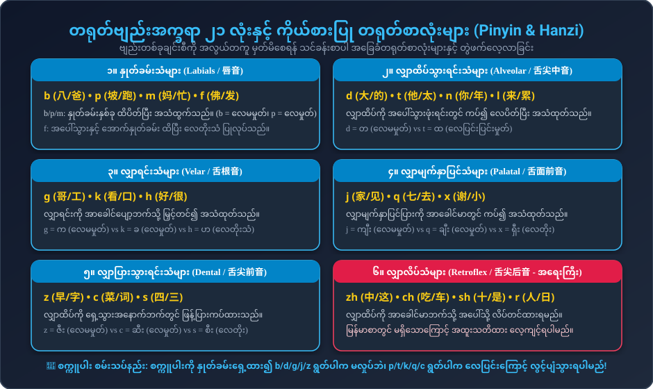
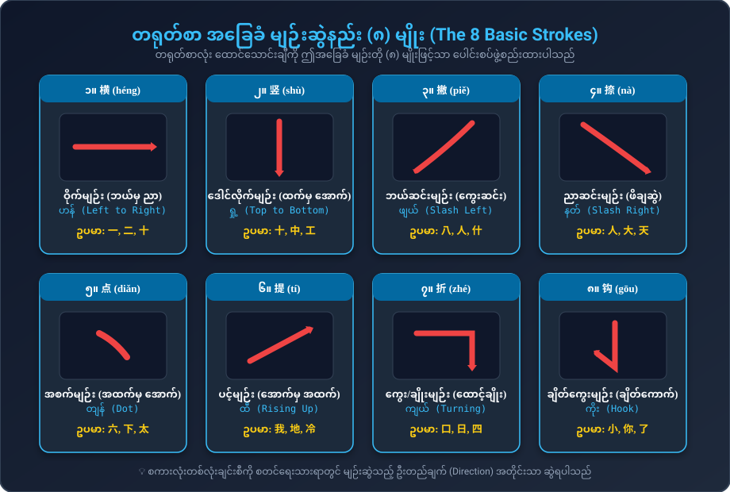
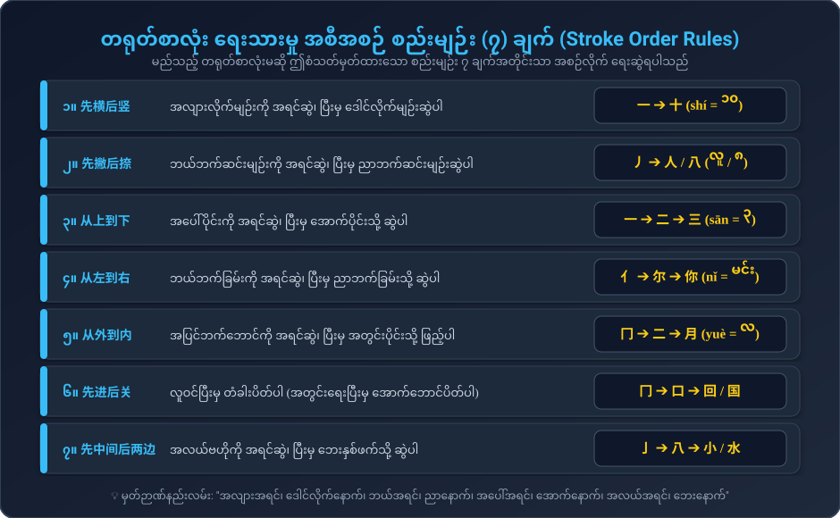

# တရုတ်ဘာသာ အခြေခံအုတ်မြစ် (Pinyin & Hanzi Foundations)
### အသံထွက်နည်းစနစ် (b, p, m, f) နှင့် စာလုံးရေးသားနည်း (Strokes & Stroke Order) လမ်းညွှန်

---

## ၁။ တရုတ်ဗျည်းအက္ခရာ ၂၁ လုံး အသံထွက်နည်းစနစ် (Pinyin Initials Articulation)

တရုတ်ဗျည်းအက္ခရာ (声母 - Shēngmǔ) ၂၁ လုံးကို အသံထုတ်ရာတွင် နှုတ်ခမ်း၊ လျှာနှင့် သွား အနေအထားအရ အောက်ပါအတိုင်း ၆ အုပ်စု ခွဲခြားလေ့လာနိုင်ပါသည်:

### (က) နှုတ်ခမ်းသံများ (Labials / 唇音)
1. **b [p]:** နှုတ်ခမ်းနှစ်ခု ထိပိတ်ပြီး အသံထုတ်သည်။ **လေမမှုတ်ရ** (မြန်မာ "ပ/ပါး" သံ)
2. **p [pʰ]:** နှုတ်ခမ်းနှစ်ခု ထိပိတ်ပြီးမှ **လေပြင်းပြင်း မှုတ်ထုတ်သည်** (မြန်မာ "ဖ/ဖား" သံ)
3. **m [m]:** နှုတ်ခမ်းနှစ်ခု ပိတ်ပြီး နှာခေါင်းမှ အသံထုတ်သည် (မြန်မာ "မ/မား" သံ)
4. **f [f]:** အပေါ်သွားနှင့် အောက်နှုတ်ခမ်း ထိပြီး လေတိုးသံ ပြုလုပ်သည် (အင်္ဂလိပ် f သံ)

> 💡 **စက္ကူပါး စမ်းသပ်နည်း (Tissue Paper Test):**  
> စက္ကူပါးလေးတစ်ရွက်ကို နှုတ်ခမ်းရှေ့ ၂ လက်မခန့်အကွာတွင် ကိုင်ထားပါ။  
> • `ba` (ပါး) ဟု ရွတ်ပါက လေမမှုတ်သဖြင့် စက္ကူမလှုပ်ရပါ။  
> • `pa` (ဖား) ဟု ရွတ်ပါက ပြင်းထန်သော လေလှိုင်းကြောင့် စက္ကူလွင့်ပျံသွားရပါမည်!

---

### (ခ) လျှာထိပ်သွားရင်းသံများ (Alveolar / 舌尖中音)
1. **d [t]:** လျှာထိပ်ကို အပေါ်သွားဖုံးရင်းတွင် ကပ်၍ အသံထုတ်သည်။ **လေမမှုတ်ရ** (တ)
2. **t [tʰ]:** လျှာထိပ်ကို အပေါ်သွားဖုံးရင်းတွင် ကပ်ပြီး **လေပြင်းပြင်း မှုတ်ထုတ်သည်** (ထ)
3. **n [n]:** နှာခေါင်းသံ (န)
4. **l [l]:** လျှာဘေးနှစ်ဖက်မှ လေထွက်သံ (လ)

---

### (ဂ) လျှာရင်းသံများ (Velar / 舌根音)
1. **g [k]:** လျှာရင်းကို အာခေါင်ပျော့တွင် ကပ်သည်။ **လေမမှုတ်ရ** (က)
2. **k [kʰ]:** လျှာရင်းကို အာခေါင်ပျော့တွင် ကပ်ပြီး **လေပြင်းပြင်း မှုတ်ထုတ်သည်** (ခ)
3. **h [x]:** လျှာရင်းနှင့် အာခေါင်ပျော့ကြားမှ လေတိုးသံ (ဟ)

---

### (ဃ) လျှာမျက်နှာပြင်သံများ (Palatal / 舌面前音)
1. **j [tɕ]:** လျှာမျက်နှာပြင်ပြားကို အာခေါင်မာတွင် ကပ်သည်။ **လေမမှုတ်ရ** (ကျီး)
2. **q [tɕʰ]:** လျှာမျက်နှာပြင်ပြားကို အာခေါင်မာတွင် ကပ်ပြီး **လေပြင်းပြင်း မှုတ်ထုတ်သည်** (ချီး)
3. **x [ɕ]:** လျှာမျက်နှာပြင်နှင့် အာခေါင်မာကြားမှ လေတိုးသံ (ရှီး)

---

### (င) လျှာလိပ်သံများ (Retroflex / 舌尖后音 - အထူးဂရုပြုရန်)
1. **zh [tʂ]:** လျှာထိပ်ကို အာခေါင်မာဘက်သို့ အပေါ်လိပ်တင်ထားသည်။ **လေမမှုတ်ရ**
2. **ch [tʂʰ]:** လျှာထိပ်ကို အပေါ်လိပ်တင်ပြီး **လေပြင်းပြင်း မှုတ်ထုတ်သည်**
3. **sh [ʂ]:** လျှာထိပ်ကို အပေါ်လိပ်တင်ပြီး လေတိုးသံ ပြုလုပ်သည်
4. **r [ʐ]:** လျှာထိပ်ကို အပေါ်လိပ်တင်ပြီး အသံအိုးတုန်ခါသံ ထုတ်သည်

---

### (စ) လျှာပြားသွားရင်းသံများ (Dental Sibilants / 舌尖前音)
1. **z [ts]:** လျှာထိပ်ကို ရှေ့သွားနောက်ဘက်တွင် ဖြန့်ကပ်သည်။ **လေမမှုတ်ရ** (ဇီး)
2. **c [tsʰ]:** လျှာထိပ်ကို ရှေ့သွားနောက်တွင် ကပ်ပြီး **လေပြင်းပြင်း မှုတ်ထုတ်သည်** (ဆီး)
3. **s [s]:** လျှာထိပ်နှင့် သွားကြားမှ လေတိုးသံ (စီး)

---

## ၂။ တရုတ်စာ အခြေခံ မျဉ်းဆွဲနည်း (၈) မျိုး (The 8 Basic Strokes)

တရုတ်စာလုံးများသည် ကျပန်းဆွဲထားသော ပုံများ မဟုတ်ဘဲ၊ အောက်ပါ အခြေခံမျဉ်း ၈ မျိုးဖြင့်သာ ပေါင်းစပ်ဖွဲ့စည်းထားပါသည်:

| # | မျဉ်းအမည် | ဖျင်းယင်း | ဆွဲသားပုံစံ | အဓိပ္ပာယ် & ဦးတည်ချက် | ဥပမာ စာလုံးများ |
|---|---|---|---|---|---|
| 1 | **横** | héng | `一` | အလျားလိုက် ဝိုက်မျဉ်း (ဘယ်မှ ညာသို့) | 一 (yī), 二 (èr), 十 (shí) |
| 2 | **竖** | shù | `丨` | ဒေါင်လိုက်မျဉ်း (အထက်မှ အောက်သို့) | 十 (shí), 中 (zhōng), 工 (gōng) |
| 3 | **撇** | piě | `丿` | ဘယ်ဘက်ဆင်းစောင်းမျဉ်း (ကွေးဆင်း) | 八 (bā), 人 (rén), 什 (shén) |
| 4 | **捺** | nà | `㇏` | ညာဘက်ဆင်းစောင်းမျဉ်း (ဖိချဆွဲ) | 人 (rén), 大 (dà), 天 (tiān) |
| 5 | **点** | diǎn | `丶` | အစက်မျဉ်း (အထက်မှ အောက်သို့ ဖိချ) | 六 (liù), 下 (xià), 太 (tài) |
| 6 | **提** | tí | `㇀` | ပင့်မျဉ်း (ဘယ်အောက်မှ ညာအထက်သို့) | 我 (wǒ), 地 (dì), 冷 (lěng) |
| 7 | **折** | zhé | `𠃍 / 𠃊` | ထောင့်ချိုးမျဉ်း (ထောင့်ကွေး) | 口 (kǒu), 日 (rì), 四 (sì) |
| 8 | **钩** | gōu | `亅 / ㇂` | ချိတ်ကောက်မျဉ်း (ချိတ်ကွေး) | 小 (xiǎo), 你 (nǐ), 了 (le) |

---

## ၃။ တရုတ်စာလုံး ရေးသားမှု အစီအစဉ် စည်းမျဉ်း (၇) ချက် (Stroke Order Rules)

တရုတ်စာလုံးတစ်လုံးကို စိတ်ကြိုက်နေရာမှ စတင်မရေးရပါ။ အောက်ပါ ၇ ချက်အတိုင်း တိကျစွာ ရေးဆွဲရပါသည်:

1. **先横后竖 (အလျားအရင်၊ ဒေါင်လိုက်နောက်):**  
   * ဥပမာ: `十` (shí = ၁၀) $\to$ `一` အရင်ဆွဲပြီးမှ `丨` ဆွဲရသည်။
2. **先撇后捺 (ဘယ်ဆင်းအရင်၊ ညာဆင်းနောက်):**  
   * ဥပမာ: `人` (rén = လူ) $\to$ `丿` အရင်ဆွဲပြီးမှ `㇏` ဆွဲရသည်။
3. **从上到下 (အပေါ်အရင်၊ အောက်နောက်):**  
   * ဥပမာ: `三` (sān = ၃) $\to$ အပေါ်မျဉ်း၊ အလယ်မျဉ်း၊ အောက်မျဉ်း အစဉ်လိုက်ဆွဲရသည်။
4. **从左到右 (ဘယ်ဘက်အရင်၊ ညာဘက်နောက်):**  
   * ဥပမာ: `你` (nǐ = မင်း) $\to$ ဘယ်ဘက်ခြမ်း `亻` အရင်ဆွဲပြီးမှ ညာဘက်ခြမ်း `尔` ကို ဆွဲရသည်။
5. **从外到内 (အပြင်ဘောင်အရင်၊ အတွင်းနောက်):**  
   * ဥပမာ: `月` (yuè = လ) $\to$ အပြင်ဘောင် `冂` အရင်ဆွဲပြီးမှ အတွင်းမျဉ်း ၂ ချောင်း ဖြည့်ရသည်။
6. **先进后关 (လူဝင်ပြီးမှ တံခါးပိတ်ပါ):**  
   * ဥပမာ: `回` (huí = ပြန်သည်) $\to$ အပြင်ဘောင် ၃ ခြမ်းဆွဲ $\to$ အတွင်း `口` ရေး $\to$ အောက်ခြေဘောင် ပိတ်သည်။
7. **先中间后两边 (အလယ်အရင်၊ ဘေးနှစ်ဖက်နောက်):**  
   * ဥပမာ: `小` (xiǎo = သေးငယ်သော) $\to$ အလယ်ချိတ်မျဉ်း `亅` အရင်ဆွဲ $\to$ ဘယ်ဘက်စက် $\to$ ညာဘက်စက် ဆွဲသည်။

---

## ၄။ စာလုံးများ ဖွဲ့စည်းတည်ဆောက်ပုံ (Character Architecture & Radicals)

တရုတ်စာလုံးများကို ဖွဲ့စည်းတည်ဆောက်ပုံအရ အောက်ပါအတိုင်း အမျိုးအစားခွဲခြားနိုင်ပါသည်:

1. **သီးခြား လွတ်လပ်စာလုံး (Single-Unit / 独体字):**  
   * အခြားစာလုံးများနှင့် ပေါင်းစပ်မထားဘဲ ရုပ်ပုံသင်္ကေတမှ တိုက်ရိုက်ဆင်းသက်လာသော စာလုံးများ (ဥပမာ: `人`, `大`, `口`, `日`, `月`, `木`)။
2. **ဘယ်-ညာ ဖွဲ့စည်းပုံ (Left-Right / 左右结构):**  
   * ဘယ်ဘက်တွင် အဓိပ္ပာယ်ပြ အမှတ်အသား (部首 - Radical) နှင့် ညာဘက်တွင် အသံထွက်ပြ အစိတ်အပိုင်း ပါဝင်သည်။  
   * `你` = `亻` (လူ) + `尔`  
   * `好` = `女` (မိခင်) + `子` (ကလေး)  
   * `忙` = `忄` (နှလုံးသား/စိတ်) + `亡` (မရှိတော့)  
3. **အပေါ်-အောက် ဖွဲ့စည်းပုံ (Top-Bottom / 上下结构):**  
   * `您` = `你` (မင်း) + `心` (နှလုံးသား)  
   * `爸` = `父` (ဖခင်) + `巴`  
   * `早` = `日` (နေမင်း) + `十` (မြေပြင်မှ ထွက်ပေါ်ခြင်း)  
4. **ဘောင်ခတ် ဖွဲ့စည်းပုံ (Enclosure / 包围结构):**  
   * `国` = `囗` (နိုင်ငံနယ်နိမိတ်ဘောင်) + `玉` (ကျောက်စိမ်းရတနာ)  
   * `回` = `囗` + `口`  
