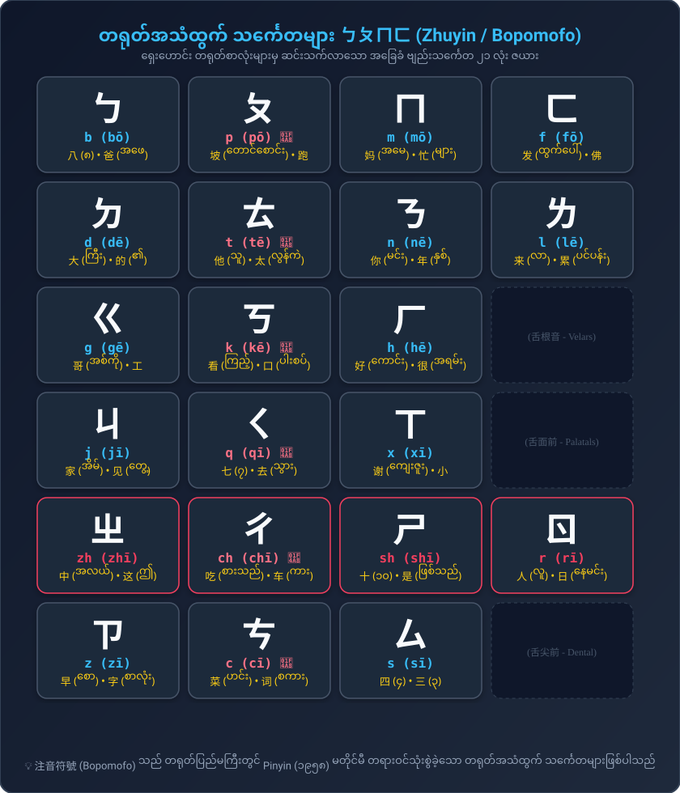

# တရုတ်ဘာသာ အခြေခံအုတ်မြစ် (Pinyin & Hanzi Foundations)
### အသံထွက်နည်းစနစ် (b, p, m, f) နှင့် စာလုံးရေးသားနည်း (Strokes & Stroke Order) လမ်းညွှန်

---

## ၁။ တရုတ်ဗျည်းအက္ခရာ ၂၁ လုံး အသံထွက်နည်းစနစ် (Pinyin Initials Articulation)

တရုတ်ဗျည်းအက္ခရာ (声母 - Shēngmǔ) ၂၁ လုံးကို အသံထုတ်ရာတွင် နှုတ်ခမ်း၊ လျှာနှင့် သွား အနေအထားအရ အောက်ပါအတိုင်း ၆ အုပ်စု ခွဲခြားလေ့လာနိုင်ပါသည်:

---

### 🀄 တရုတ်အသံထွက် သင်္ကေတများ ㄅㄆㄇㄈ (Zhuyin / Bopomofo 4-Column Chart)

| ကော်လံ ၁ | ကော်လံ ၂ | ကော်လံ ၃ | ကော်လံ ၄ |
| :---: | :---: | :---: | :---: |
| **ㄅ** `b` (bō) 八 (၈) / 爸 (အဖေ) *ပါးသံ (လေမမှုတ်)* | **ㄆ** `p` (pō) 💨 坡 (တောင်စောင်း) / 跑 (ပြေး) *ဖားသံ (လေမှုတ်ထုတ်)* | **ㄇ** `m` (mō) 妈 (အမေ) / 忙 (အလုပ်ရှုပ်) *မားသံ (နှာခေါင်း)* | **ㄈ** `f` (fō) 佛 (ဘုရား) / 发 (ထုတ်/ပို့) *အင်္ဂလိပ် f သံ* |
| **ㄉ** `d` (dē) 大 (ကြီးမား) / 的 (၏) *တသံ (လေမမှုတ်)* | **ㄊ** `t` (tē) 💨 他 (သူ) / 太 (အလွန်) *ထသံ (လေမှုတ်ထုတ်)* | **ㄋ** `n` (nē) 你 (မင်း) / 年 (နှစ်) *နသံ (နှာခေါင်း)* | **ㄌ** `l` (lē) 来 (လာသည်) / 累 (ပင်ပန်း) *လသံ (လျှာဘေး)* |
| **ㄍ** `g` (gē) 哥 (အစ်ကို) / 工 (အလုပ်) *ကသံ (လေမမှုတ်)* | **ㄎ** `k` (kē) 💨 看 (ကြည့်သည်) / 口 (ပါးစပ်) *ခသံ (လေမှုတ်ထုတ်)* | **ㄏ** `h` (hē) 好 (ကောင်း) / 很 (အလွန်) *ဟသံ (လည်ချောင်း)* | *(舌根音 - Velars)* |
| **ㄐ** `j` (jī) 家 (အိမ်) / 见 (တွေ့သည်) *ကျီးသံ (လေမမှုတ်)* | **ㄑ** `q` (qī) 💨 七 (၇) / 去 (သွားသည်) *ချီးသံ (လေမှုတ်ထုတ်)* | **ㄒ** `x` (xī) 谢 (ကျေးဇူး) / 小 (သေးငယ်) *ရှီးသံ (လေတိုး)* | *(舌面前 - Palatals)* |
| **ㄓ** `zh` (zhī) 中 (အလယ်) / 这 (ဤအရာ) *လျှာလိပ် တျီး (လေမမှုတ်)* | **ㄔ** `ch` (chī) 💨 吃 (စားသည်) / 车 (ကား) *လျှာလိပ် ချီး (လေမှုတ်)* | **ㄕ** `sh` (shī) 十 (၁၀) / 是 (ဖြစ်သည်) *လျှာလိပ် ရှီး (လေတိုး)* | **ㄖ** `r` (rī) 人 (လူ) / 日 (နေ့/နေ) *လျှာလိပ် ဂျီး/ရီး* |
| **ㄗ** `z` (zī) 早 (မနက်) / 字 (စာလုံး) *ဇီးသံ (လေမမှုတ်)* | **ㄘ** `c` (cī) 💨 菜 (ဟင်း) / 词 (စကားလုံး) *ဆီးသံ (လေမှုတ်ထုတ်)* | **ㄙ** `s` (sī) 四 (၄) / 三 (၃) *စီးသံ (လေတိုး)* | *(舌尖前 - Dentals)* |

---

### (က) နှုတ်ခမ်းသံများ (Labials / 唇音)
1. **b (ㄅ) [p]:** နှုတ်ခမ်းနှစ်ခု ထိပိတ်ပြီး အသံထုတ်သည်။ **လေမမှုတ်ရ** (မြန်မာ "ပ/ပါး" သံ) — ဥပမာ: **八** (bā - ၈), **爸** (bà - အဖေ)
2. **p (ㄆ) [pʰ]:** နှုတ်ခမ်းနှစ်ခု ထိပိတ်ပြီးမှ **လေပြင်းပြင်း မှုတ်ထုတ်သည်** (မြန်မာ "ဖ/ဖား" သံ) — ဥပမာ: **坡** (pō - တောင်စောင်း), **跑** (pǎo - ပြေးသည်)
3. **m (ㄇ) [m]:** နှုတ်ခမ်းနှစ်ခု ပိတ်ပြီး နှာခေါင်းမှ အသံထုတ်သည် (မြန်မာ "မ/မား" သံ) — ဥပမာ: **妈** (mā - အမေ), **忙** (máng - အလုပ်ရှုပ်)
4. **f (ㄈ) [f]:** အပေါ်သွားနှင့် အောက်နှုတ်ခမ်း ထိပြီး လေတိုးသံ ပြုလုပ်သည် (အင်္ဂလိပ် f သံ) — ဥပမာ: **佛** (fó - ဘုရား), **发** (fā - ပို့/ထုတ်)

> 💡 **စက္ကူပါး စမ်းသပ်နည်း (Tissue Paper Test):**  
> စက္ကူပါးလေးတစ်ရွက်ကို နှုတ်ခမ်းရှေ့ ၂ လက်မခန့်အကွာတွင် ကိုင်ထားပါ။  
> • `ba` (ပါး) ဟု ရွတ်ပါက လေမမှုတ်သဖြင့် စက္ကူမလှုပ်ရပါ။  
> • `pa` (ဖား) ဟု ရွတ်ပါက ပြင်းထန်သော လေလှိုင်းကြောင့် စက္ကူလွင့်ပျံသွားရပါမည်!

---

### (ခ) လျှာထိပ်သွားရင်းသံများ (Alveolar / 舌尖中音)
1. **d (ㄉ) [t]:** လျှာထိပ်ကို အပေါ်သွားဖုံးရင်းတွင် ကပ်၍ အသံထုတ်သည်။ **လေမမှုတ်ရ** (တ) — ဥပမာ: **大** (dà - ကြီးမား), **的** (de - ၏)
2. **t (ㄊ) [tʰ]:** လျှာထိပ်ကို အပေါ်သွားဖုံးရင်းတွင် ကပ်ပြီး **လေပြင်းပြင်း မှုတ်ထုတ်သည်** (ထ) — ဥပမာ: **他** (tā - သူ), **太** (tài - အလွန်)
3. **n (ㄋ) [n]:** နှာခေါင်းသံ (န) — ဥပမာ: **你** (nǐ - မင်း), **年** (nián - နှစ်)
4. **l (ㄌ) [l]:** လျှာဘေးနှစ်ဖက်မှ လေထွက်သံ (လ) — ဥပမာ: **来** (lái - လာသည်), **累** (lèi - ပင်ပန်း)

---

### (ဂ) လျှာရင်းသံများ (Velar / 舌根音)
1. **g (ㄍ) [k]:** လျှာရင်းကို အာခေါင်ပျော့တွင် ကပ်သည်။ **လေမမှုတ်ရ** (က) — ဥပမာ: **哥** (gē - အစ်ကို), **工** (gōng - အလုပ်)
2. **k (ㄎ) [kʰ]:** လျှာရင်းကို အာခေါင်ပျော့တွင် ကပ်ပြီး **လေပြင်းပြင်း မှုတ်ထုတ်သည်** (ခ) — ဥပမာ: **看** (kàn - ကြည့်သည်), **口** (kǒu - ပါးစပ်)
3. **h (ㄏ) [x]:** လျှာရင်းနှင့် အာခေါင်ပျော့ကြားမှ လေတိုးသံ (ဟ) — ဥပမာ: **好** (hǎo - ကောင်း), **很** (hěn - အလွန်)

---

### (ဃ) လျှာမျက်နှာပြင်သံများ (Palatal / 舌面前音)
1. **j (ㄐ) [tɕ]:** လျှာမျက်နှာပြင်ပြားကို အာခေါင်မာတွင် ကပ်သည်။ **လေမမှုတ်ရ** (ကျီး) — ဥပမာ: **家** (jiā - အိမ်), **见** (jiàn - တွေ့ဆုံသည်)
2. **q (ㄑ) [tɕʰ]:** လျှာမျက်နှာပြင်ပြားကို အာခေါင်မာတွင် ကပ်ပြီး **လေပြင်းပြင်း မှုတ်ထုတ်သည်** (ချီး) — ဥပမာ: **七** (qī - ၇), **去** (qù - သွားသည်)
3. **x (ㄒ) [ɕ]:** လျှာမျက်နှာပြင်နှင့် အာခေါင်မာကြားမှ လေတိုးသံ (ရှီး) — ဥပမာ: **谢** (xiè - ကျေးဇူးတင်), **小** (xiǎo - သေးငယ်)

---

### (င) လျှာလိပ်သံများ (Retroflex / 舌尖后音 - အထူးဂရုပြုရန်)
1. **zh (ㄓ) [tʂ]:** လျှာထိပ်ကို အာခေါင်မာဘက်သို့ အပေါ်လိပ်တင်ထားသည်။ **လေမမှုတ်ရ** — ဥပမာ: **中** (zhōng - အလယ်), **这** (zhè - ဤအရာ)
2. **ch (ㄔ) [tʂʰ]:** လျှာထိပ်ကို အပေါ်လိပ်တင်ပြီး **လေပြင်းပြင်း မှုတ်ထုတ်သည်** — ဥပမာ: **吃** (chī - စားသည်), **车** (chē - ကား)
3. **sh (ㄕ) [ʂ]:** လျှာထိပ်ကို အပေါ်လိပ်တင်ပြီး လေတိုးသံ ပြုလုပ်သည် — ဥပမာ: **十** (shí - ၁၀), **是** (shì - ဖြစ်သည်)
4. **r (ㄖ) [ʐ]:** လျှာထိပ်ကို အပေါ်လိပ်တင်ပြီး အသံအိုးတုန်ခါသံ ထုတ်သည် — ဥပမာ: **人** (rén - လူ), **日** (rì - နေ့/နေ)

---

### (စ) လျှာပြားသွားရင်းသံများ (Dental Sibilants / 舌尖前音)
1. **z (ㄗ) [ts]:** လျှာထိပ်ကို ရှေ့သွားနောက်ဘက်တွင် ဖြန့်ကပ်သည်။ **လေမမှုတ်ရ** (ဇီး) — ဥပမာ: **早** (zǎo - မနက်), **字** (zì - စာလုံး)
2. **c (ㄘ) [tsʰ]:** လျှာထိပ်ကို ရှေ့သွားနောက်တွင် ကပ်ပြီး **လေပြင်းပြင်း မှုတ်ထုတ်သည်** (ဆီး) — ဥပမာ: **菜** (cài - ဟင်း), **词** (cí - ဝေါဟာရ)
3. **s (ㄙ) [s]:** လျှာထိပ်နှင့် သွားကြားမှ လေတိုးသံ (စီး) — ဥပမာ: **四** (sì - ၄), **三** (sān - ၃)

---

## ၂။ တရုတ်စာ အခြေခံ မျဉ်းဆွဲနည်း (၈) မျိုး (The 8 Basic Strokes)

တရုတ်စာလုံးများသည် ကျပန်းဆွဲထားသော ပုံများ မဟုတ်ဘဲ၊ အောက်ပါ အခြေခံမျဉ်း ၈ မျိုးဖြင့်သာ ပေါင်းစပ်ဖွဲ့စည်းထားပါသည်:

| # | မျဉ်းအမည် | ဖျင်းယင်း | ဆွဲသားပုံစံ | အဓိပ္ပာယ် & ဦးတည်ချက် | ဥပမာ စာလုံးများ |
|---|---|---|---|---|---|
| 1 | **横** | héng | `一` | အလျားလိုက် ဝိုက်မျဉ်း (ဘယ်မှ ညာသို့) | 一 (yī), 二 (èr), 十 (shí) |
| 2 | **竖** | shù | `丨` | ဒေါင်လိုက်မျဉ်း (အထက်မှ အောက်သို့) | 十 (shí), 中 (zhōng), 工 (gōng) |
| 3 | **撇** | piě | `丿` | ဘယ်ဘက်ဆင်းစောင်းမျဉ်း (ကွေးဆင်း) | 八 (bā), 人 (rén), 什 (shén) |
| 4 | **捺** | nà | `㇏` | ညာဘက်ဆင်းစောင်းမျဉ်း (ဖိချဆွဲ) | 人 (rén), 大 (dà), 天 (tiān) |
| 5 | **点** | diǎn | `丶` | အစက်မျဉ်း (အထက်မှ အောက်သို့ ဖိချ) | 六 (liù), 下 (xià), 太 (tài) |
| 6 | **提** | tí | `㇀` | ပင့်မျဉ်း (ဘယ်အောက်မှ ညာအထက်သို့) | 我 (wǒ), 地 (dì), 冷 (lěng) |
| 7 | **折** | zhé | `𠃍 / 𠃊` | ထောင့်ချိုးမျဉ်း (ထောင့်ကွေး) | 口 (kǒu), 日 (rì), 四 (sì) |
| 8 | **钩** | gōu | `亅 / ㇂` | ချိတ်ကောက်မျဉ်း (ချိတ်ကွေး) | 小 (xiǎo), 你 (nǐ), 了 (le) |

---

## ၃။ တရုတ်စာလုံး ရေးသားမှု အစီအစဉ် စည်းမျဉ်း (၇) ချက် (Stroke Order Rules)

တရုတ်စာလုံးတစ်လုံးကို စိတ်ကြိုက်နေရာမှ စတင်မရေးရပါ။ အောက်ပါ ၇ ချက်အတိုင်း တိကျစွာ ရေးဆွဲရပါသည်:

1. **先横后竖 (အလျားအရင်၊ ဒေါင်လိုက်နောက်):**  
   * ဥပမာ: `十` (shí = ၁၀) $\to$ `一` အရင်ဆွဲပြီးမှ `丨` ဆွဲရသည်။
2. **先撇后捺 (ဘယ်ဆင်းအရင်၊ ညာဆင်းနောက်):**  
   * ဥပမာ: `人` (rén = လူ) $\to$ `丿` အရင်ဆွဲပြီးမှ `㇏` ဆွဲရသည်။
3. **从上到下 (အပေါ်အရင်၊ အောက်နောက်):**  
   * ဥပမာ: `三` (sān = ၃) $\to$ အပေါ်မျဉ်း၊ အလယ်မျဉ်း၊ အောက်မျဉ်း အစဉ်လိုက်ဆွဲရသည်။
4. **从左到右 (ဘယ်ဘက်အရင်၊ ညာဘက်နောက်):**  
   * ဥပမာ: `你` (nǐ = မင်း) $\to$ ဘယ်ဘက်ခြမ်း `亻` အရင်ဆွဲပြီးမှ ညာဘက်ခြမ်း `尔` ကို ဆွဲရသည်။
5. **从外到内 (အပြင်ဘောင်အရင်၊ အတွင်းနောက်):**  
   * ဥပမာ: `月` (yuè = လ) $\to$ အပြင်ဘောင် `冂` အရင်ဆွဲပြီးမှ အတွင်းမျဉ်း ၂ ချောင်း ဖြည့်ရသည်။
6. **先进后关 (လူဝင်ပြီးမှ တံခါးပိတ်ပါ):**  
   * ဥပမာ: `回` (huí = ပြန်သည်) $\to$ အပြင်ဘောင် ၃ ခြမ်းဆွဲ $\to$ အတွင်း `口` ရေး $\to$ အောက်ခြေဘောင် ပိတ်သည်။
7. **先中间后两边 (အလယ်အရင်၊ ဘေးနှစ်ဖက်နောက်):**  
   * ဥပမာ: `小` (xiǎo = သေးငယ်သော) $\to$ အလယ်ချိတ်မျဉ်း `亅` အရင်ဆွဲ $\to$ ဘယ်ဘက်စက် $\to$ ညာဘက်စက် ဆွဲသည်။

---

## ၄။ စာလုံးများ ဖွဲ့စည်းတည်ဆောက်ပုံ (Character Architecture & Radicals)

တရုတ်စာလုံးများကို ဖွဲ့စည်းတည်ဆောက်ပုံအရ အောက်ပါအတိုင်း အမျိုးအစားခွဲခြားနိုင်ပါသည်:

1. **သီးခြား လွတ်လပ်စာလုံး (Single-Unit / 独体字):**  
   * အခြားစာလုံးများနှင့် ပေါင်းစပ်မထားဘဲ ရုပ်ပုံသင်္ကေတမှ တိုက်ရိုက်ဆင်းသက်လာသော စာလုံးများ (ဥပမာ: `人`, `大`, `口`, `日`, `月`, `木`)။
2. **ဘယ်-ညာ ဖွဲ့စည်းပုံ (Left-Right / 左右结构):**  
   * ဘယ်ဘက်တွင် အဓိပ္ပာယ်ပြ အမှတ်အသား (部首 - Radical) နှင့် ညာဘက်တွင် အသံထွက်ပြ အစိတ်အပိုင်း ပါဝင်သည်။  
   * `你` = `亻` (လူ) + `尔`  
   * `好` = `女` (မိခင်) + `子` (ကလေး)  
   * `忙` = `忄` (နှလုံးသား/စိတ်) + `亡` (မရှိတော့)  
3. **အပေါ်-အောက် ဖွဲ့စည်းပုံ (Top-Bottom / 上下结构):**  
   * `您` = `你` (မင်း) + `心` (နှလုံးသား)  
   * `爸` = `父` (ဖခင်) + `巴`  
   * `早` = `日` (နေမင်း) + `十` (မြေပြင်မှ ထွက်ပေါ်ခြင်း)  
4. **ဘောင်ခတ် ဖွဲ့စည်းပုံ (Enclosure / 包围结构):**  
   * `国` = `囗` (နိုင်ငံနယ်နိမိတ်ဘောင်) + `玉` (ကျောက်စိမ်းရတနာ)  
   * `回` = `囗` + `口`  
