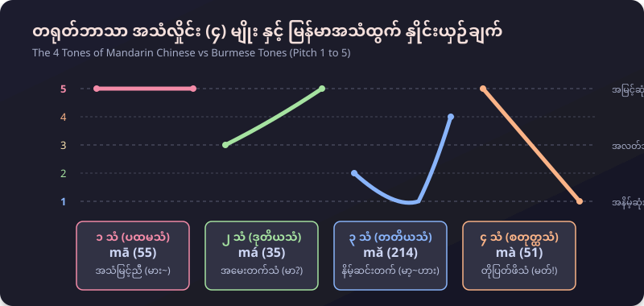
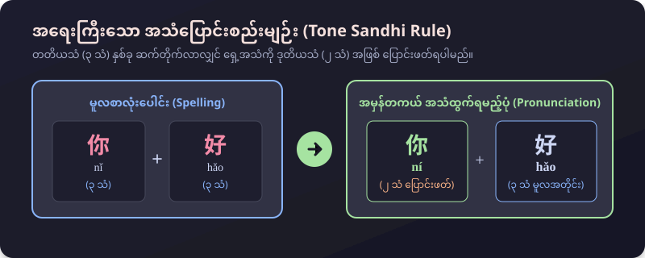
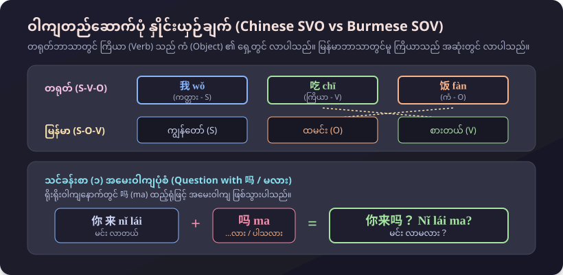
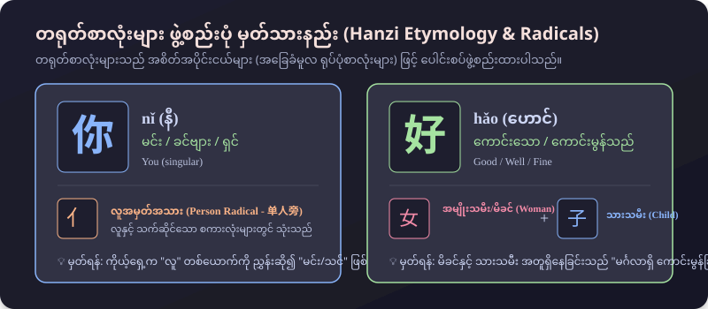

# 第一课：你好！(သင်ခန်းစာ ၁ - မင်္ဂလာပါ)
### တရုတ်စကားပြော အခြေခံသင်ခန်းစာ (မြန်မာသင်သားများအတွက် အထူးပြုပြင်ရေးသားချက်)

---

## ၁။ တရုတ်အသံလှိုင်း (၄) မျိုး နှင့် မြန်မာအသံထွက် နှိုင်းယှဉ်ချက် (The 4 Tones)

တရုတ်ဘာသာစကားသည် အသံလှိုင်းအနိမ့်အမြင့်ပေါ်မူတည်၍ အဓိပ္ပာယ်ပြောင်းလဲသော ဘာသာစကား (Tonal Language) ဖြစ်ပါသည်။ မြန်မာဘာသာစကားတွင်လည်း အသံနိမ့်သံ၊ အသံမြင့်သံ၊ သက်သံများ ရှိသောကြောင့် မြန်မာသင်သားများအတွက် အလွန်ရင်းနှီးလွယ်ကူပါသည်။

| အသံလှိုင်း | သင်္ကေတ | အသံလှိုင်းဂဏန်း | မြန်မာအသံထွက် ပုံစံ | ဥပမာ (m-a) | အဓိပ္ပာယ် |
|---|---|---|---|---|---|
| **၁ သံ (ပထမသံ)** | `¯` (mā) | **55** | အမြင့်ညီညာသံ (မား~) | **mā (妈)** | အမေ |
| **၂ သံ (ဒုတိယသံ)** | `ˊ` (má) | **35** | အောက်မှ အထက်သို့ တက်သံ (မာ?) | **má (麻)** | လျှော်ပင် |
| **၃ သံ (တတိယသံ)** | `ˇ` (mǎ) | **214** | နိမ့်ဆင်းပြီးမှ အပေါ်ပြန်တက်သံ (မာ့..ဟား) | **mǎ (马)** | မြင်း |
| **၄ သံ (စတုတ္ထသံ)** | `ˋ` (mà) | **51** | ထိပ်ဆုံးမှ အောက်သို့ ပြတ်ကျဖိသံ (မတ်!) | **mà (骂)** | ဆူပူကြိမ်းမောင်းသည် |

---

## ၂။ သင်ခန်းစာ (၁) အခြေခံ ဝါကျကြီး (၄) ခု (Key Sentences)

| # | တရုတ်စာလုံး (Hanzi) | ဖျင်းယင်း (Pinyin) | မြန်မာအသံထွက် | မြန်မာအဓိပ္ပာယ် |
|---|---|---|---|---|
| **001** | **你好！** | nǐ hǎo *(အသံပြောင်း: ní hǎo)* | **နီ ဟောင်** | မင်္ဂလာပါ / နေကောင်းလား |
| **002** | **你好吗？** | nǐ hǎo ma | **နီ ဟောင် မာ** | နေကောင်းရဲ့လားခင်ဗျာ/ရှင့်? |
| **003** | **（我）很好。** | (wǒ) hěn hǎo | **(ဝေါ်) ဟန် ဟောင်** | (ကျွန်တော်/ကျွန်မ) နေကောင်းပါတယ် |
| **004** | **我也很好。** | wǒ yě hěn hǎo | **ဝေါ် ရယ် ဟန် ဟောင်** | ကျွန်တော်/ကျွန်မလည်း နေကောင်းပါတယ် |

---

## ၃။ အပြန်အလှန် စကားပြောခန်းများ (Conversations)

### စကားပြောခန်း (၁) : လမ်းကြုံဆုံတွေ့စဉ် နှုတ်ဆက်ခြင်း
* **大卫 (ဒါဝိဒ်):** 玛丽，你好！ *(Mǎlì, nǐ hǎo! / မာရီ၊ မင်္ဂလာပါ!)*
* **玛丽 (မာရီ):** 你好，大卫！ *(Nǐ hǎo, Dàwèi! / မင်္ဂလာပါ ဒါဝိဒ်!)*

---

### စကားပြောခန်း (၂) : နေကောင်းကျန်းမာကြောင်း အမေးအဖြေ
* **王兰 (ဝမ်လန်):** 你好吗？ *(Nǐ hǎo ma? / နေကောင်းရဲ့လားရှင်?)*
* **刘京 (လျူကျင်း):** 我很好。你好吗？ *(Wǒ hěn hǎo. Nǐ hǎo ma? / ကျွန်တော် နေကောင်းပါတယ်။ မင်းရော နေကောင်းလား?)*
* **王兰 (ဝမ်လန်):** 我也很好。 *(Wǒ yě hěn hǎo. / ကျွန်မလည်း နေကောင်းပါတယ်ရှင်။)*

---

## ၄။ မြန်မာသင်သားများအတွက် အထူးသဒ္ဒါရှင်းလင်းချက် (Grammar Clinic)

### (က) ၃ သံ နှစ်လုံးဆင့်ပါက ရှေ့စကားလုံးကို ၂ သံ ပြောင်းဖတ်ရခြင်း (Tone Sandhi)

* `你` (nǐ - ၃ သံ) နှင့် `好` (hǎo - ၃ သံ) နှစ်လုံး တွဲဖတ်သည့်အခါ စာလုံးပေါင်းရာတွင် `nǐ hǎo` ဟု ပေါင်းသော်လည်း အသံထွက်သည့်အခါ `ní hǎo` (၂ သံ + ၃ သံ) အဖြစ် **နီ ဟောင်** ဟု ပြောင်း၍ အသံထွက်ရပါမည်။

### (ခ) ဝါကျတည်ဆောက်ပုံ ကွာခြားချက် (တရုတ် SVO vs မြန်မာ SOV)

* **တရုတ်:** ကတ္တား (Subject) + **ကြိယာ (Verb)** + ကံ (Object)
  * `我 吃饭` (wǒ chī fàn) $\to$ `ဝေါ် (ကျွန်တော်)` + `ချီး (စားတယ်)` + `ဖန့် (ထမင်း)`
* **မြန်မာ:** ကတ္တား (Subject) + ကံ (Object) + **ကြိယာ (Verb)**
  * `ကျွန်တော် ထမင်း စားတယ်`

### (ဂ) အမေးဝါကျ ပြုလုပ်ခြင်း (Question Particle "吗")
* မည်သည့် ရိုးရိုးဝါကျမဆို အဆုံးတွင် `吗 (ma)` ကို ကပ်လိုက်ရုံဖြင့် အမေးဝါကျ ဖြစ်လာပါသည်။
  * 你好 (မင်း နေကောင်းတယ်) + 吗 = **你好吗？** (မင်း နေကောင်းလား?)
  * 你来 (မင်း လာတယ်) + 吗 = **你来吗？** (မင်း လာမလား?)

### (ဃ) စာလုံးများ ဖွဲ့စည်းပုံ မှတ်သားနည်း (Hanzi Etymology & Radicals)

* **你 (nǐ):** `亻` (လူအမှတ်အသား) + `尔` = ကိုယ့်ရှေ့မှောက်က "လူ" ဖြစ်၍ "မင်း/သင်"
* **好 (hǎo):** `女` (အမျိုးသမီး/မိခင်) + `子` (သားသမီး) = မိခင်နှင့် သားသမီး အတူရှိနေခြင်းသည် "မင်္ဂလာရှိ ကောင်းမွန်ခြင်း"

---

## ၅။ ဝေါဟာရ စာရင်းအပြည့်အစုံ (Full Vocabulary)

| # | တရုတ်စာလုံး | ဖျင်းယင်း | မြန်မာအသံထွက် | အဓိပ္ပာယ် | အမျိုးအစား |
|---|---|---|---|---|---|
| 1 | **你** | nǐ | နီ | မင်း / ခင်ဗျား / နင် / ရှင် | နာမ်စား (Pronoun) |
| 2 | **好** | hǎo | ဟောင် | ကောင်းသော / ကောင်းမွန်သည် | နာမဝိသေသန (Adjective) |
| 3 | **吗** | ma | မာ | ...လား / ပါသလား | အမေးပစ္စည်း (Particle) |
| 4 | **我** | wǒ | ဝေါ် | ကျွန်တော် / ကျွန်မ / ငါ | နာမ်စား (Pronoun) |
| 5 | **很** | hěn | ဟန် | အရမ်း / အလွန် | ကြိယာဝိသေသန (Adverb) |
| 6 | **也** | yě | ရယ် | လည်းပဲ | ကြိယာဝိသေသန (Adverb) |
| 7 | **你们** | nǐmen | နီမန် | မင်းတို့ / ခင်ဗျားတို့ | နာမ်စား (Plural) |
| 8 | **他们** | tāmen | ထာမန် | သူတို့ | နာမ်စား (Plural) |
| 9 | **来** | lái | လိုင် | လာသည် | ကြိယာ (Verb) |
| 10 | **不** | bù | ပု / ပူ့ | မဟုတ် / မ...ဘူး | အငြင်းစကားလုံး (Negative) |

---

## ၆။ အသုံးချ လေ့ကျင့်ခန်း (Exercises)
1. မိတ်ဆွေတစ်ဦးကို "မင်္ဂလာပါ" ဟု နှုတ်ဆက်ကြည့်ပါ။
2. "မင်း လာမလား?" ကို တရုတ်လို မည်သို့ မေးမည်နည်း? (အဖြေ: `你来吗？` - Nǐ lái ma?)
3. "ငါ မလာဘူး" ကို တရုတ်လို မည်သို့ ဖြေမည်နည်း? (အဖြေ: `我不来。` - Wǒ bù lái.)
