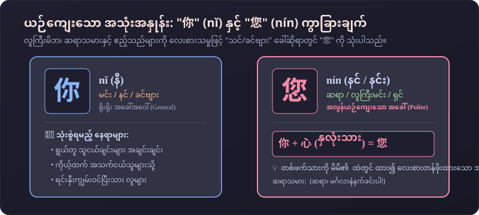
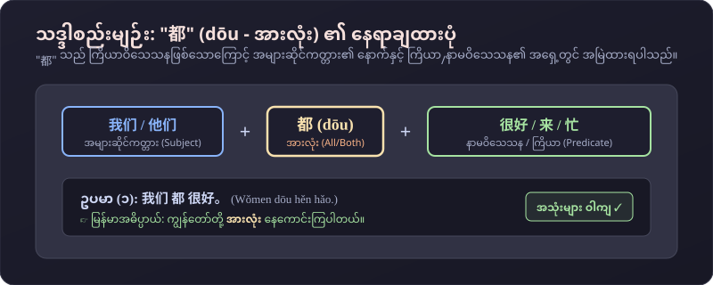
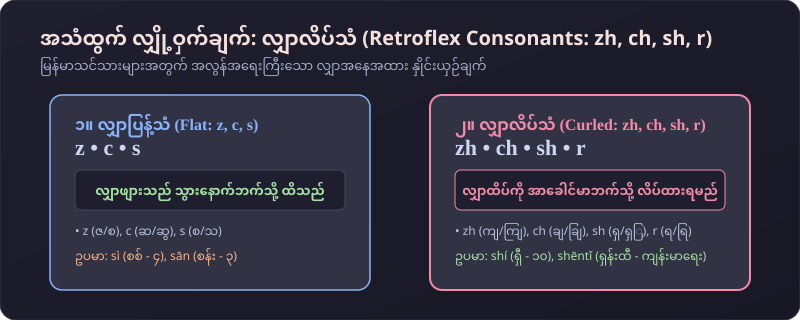
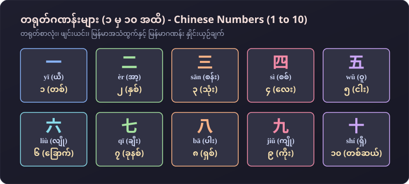

# 第二课：你身体好吗？(သင်ခန်းစာ ၂ - ကျန်းမာရေးကောင်းရဲ့လား)
### တရုတ်စကားပြော အခြေခံသင်ခန်းစာ (မြန်မာသင်သားများအတွက် အထူးပြုပြင်ရေးသားချက်)

---

## ၁။ သင်ခန်းစာ (၂) အခြေခံ ဝါကျကြီး (၄) ခု (Key Sentences)

| # | တရုတ်စာလုံး (Hanzi) | ဖျင်းယင်း (Pinyin) | မြန်မာအသံထွက် | မြန်မာအဓိပ္ပာယ် |
|---|---|---|---|---|
| **005** | **你早！** | nǐ zǎo | **နီ ဇောင်** | မင်္ဂလာနံနက်ခင်းပါ / စောစောစီးစီး မင်္ဂလာပါ |
| **006** | **你身体好吗？** | nǐ shēntǐ hǎo ma? | **နီ ရှန်းထီ ဟောင် မာ** | ကျန်းမာရေး ကောင်းရဲ့လားခင်ဗျာ/ရှင့်? |
| **007** | **谢谢！** | xièxie! | **ရှဲ့ရှဲ့** | ကျေးဇူးတင်ပါတယ်! |
| **008** | **再见！** | zàijiàn! | **ဇိုက်ကျန့်** | နောက်မှ ပြန်တွေ့မယ် / နှုတ်ဆက်ပါတယ်! |

---

## ၂။ လက်တွေ့ စကားပြောခန်းများ (Conversations)

### စကားပြောခန်း (၁) : ဆရာနှစ်ဦး မနက်ခင်း ဆုံတွေ့စဉ် နှုတ်ဆက်ခြင်း
* **李老师 (လီဆရာ):** 你早！
  * ဖျင်းယင်း: *Nǐ zǎo!*
  * မြန်မာအသံထွက်: **နီ ဇောင်**
  * အဓိပ္ပာယ်: မင်္ဂလာနံနက်ခင်းပါ!
* **王老师 (ဝမ်ဆရာမ):** 你早！
  * ဖျင်းယင်း: *Nǐ zǎo!*
  * မြန်မာအသံထွက်: **နီ ဇောင်**
  * အဓိပ္ပာယ်: မင်္ဂလာနံနက်ခင်းပါ!
* **李老师 (လီဆရာ):** 你身体好吗？
  * ဖျင်းယင်း: *Nǐ shēntǐ hǎo ma?*
  * မြန်မာအသံထွက်: **နီ ရှန်းထီ ဟောင် မာ**
  * အဓိပ္ပာယ်: ကျန်းမာရေး ကောင်းရဲ့လားခင်ဗျာ?
* **王老师 (ဝမ်ဆရာမ):** 很好。谢谢！
  * ဖျင်းယင်း: *Hěn hǎo. Xièxie!*
  * မြန်မာအသံထွက်: **ဟန် ဟောင်။ ရှဲ့ရှဲ့**
  * အဓိပ္ပာယ်: အရမ်းကောင်းပါတယ်။ ကျေးဇူးတင်ပါတယ်!

---

### စကားပြောခန်း (၂) : ဆရာနှင့် ကျောင်းသားများ နှုတ်ဆက်ခြင်း
* **张老师 (ကျန်းဆရာ):** 你们好吗？
  * ဖျင်းယင်း: *Nǐmen hǎo ma?*
  * မြန်မာအသံထွက်: **နီမန် ဟောင် မာ**
  * အဓိပ္ပာယ်: မင်းတို့ နေကောင်းကြရဲ့လား?
* **王兰 (ဝမ်လန်):** 我们都很好。您身体好吗？
  * ဖျင်းယင်း: *Wǒmen dōu hěn hǎo. Nín shēntǐ hǎo ma?*
  * မြန်မာအသံထွက်: **ဝေါ်မန် သိုး ဟန် ဟောင်။ နင် ရှန်းထီ ဟောင် မာ**
  * အဓိပ္ပာယ်: ကျွန်မတို့ အားလုံး နေကောင်းကြပါတယ်။ ဆရာကော ကျန်းမာရေး ကောင်းရဲ့လားရှင့်?
* **张老师 (ကျန်းဆရာ):** 也很好。再见！
  * ဖျင်းယင်း: *Yě hěn hǎo. Zàijiàn!*
  * မြန်မာအသံထွက်: **ရယ် ဟန် ဟောင်။ ဇိုက်ကျန့်**
  * အဓိပ္ပာယ်: ငါလည်း နေကောင်းပါတယ်။ နောက်မှတွေ့မယ်!
* **刘京 (လျူကျင်း):** 再见！
  * ဖျင်းယင်း: *Zàijiàn!*
  * မြန်မာအသံထွက်: **ဇိုက်ကျန့်**
  * အဓိပ္ပာယ်: နှုတ်ဆက်ပါတယ် ဆရာ!

---

## ၃။ မြန်မာသင်သားများအတွက် အထူးသဒ္ဒါရှင်းလင်းချက် (Grammar Clinic)

### (က) ယဉ်ကျေးသော အခေါ်အဝေါ်: "你" နှင့် "您"

* **你 (nǐ - နီ):** ရွယ်တူများ၊ ငယ်သူများ သို့မဟုတ် ရင်းနှီးသူများအကြား သုံးသည်။
* **您 (nín - နင်/နင်း):** ဆရာသမားများ၊ သက်ကြီးဝါကြီးများနှင့် ဧည့်သည်များကို လေးစားသမှုဖြင့် သုံးသည်။
  * 💡 **မှတ်သားနည်း:** `你` အောက်တွင် နှလုံးသား `心 (xīn)` ထည့်ထားသောကြောင့် တစ်ဖက်သားကို ရင်ထဲထည့်၍ လေးစားသော အဓိပ္ပာယ်ဖြစ်ပါသည်။

---

### (ခ) "အားလုံး" ကို ဖော်ပြသော ကြိယာဝိသေသန: "都" (dōu)

* တရုတ်ဘာသာတွင် `都` (dōu - အားလုံး) သည် အများဆိုင်ကတ္တား၏ နောက်နှင့် ကြိယာ/နာမဝိသေသန၏ အရှေ့တွင် လာပါသည်။
* **ဖွဲ့စည်းပုံ:** `အများဆိုင်ကတ္တား + 都 + နာမဝိသေသန/ကြိယာ`
  * ဥပမာ: **我们 都 很好。** *(Wǒmen dōu hěn hǎo. / ကျွန်တော်တို့ အားလုံး နေကောင်းကြပါတယ်။)*
  * ဥပမာ: **他们 都 来。** *(Tāmen dōu lái. / သူတို့ အားလုံး လာကြတယ်။)*

---

### (ဂ) အသံထွက် လျှို့ဝှက်ချက်: လျှာလိပ်သံ (Retroflex Consonants: zh, ch, sh, r)

* မြန်မာစာတွင် လျှာလိပ်သံ မရှိသောကြောင့် အစပိုင်းတွင် ဂရုစိုက် လေ့ကျင့်ရပါမည်။
* **zh, ch, sh, r** ကို အသံထွက်သည့်အခါ **လျှာထိပ်ကို အာခေါင်မာဘက်သို့ အပေါ်လိပ်၍** လေမှုတ်ထုတ်ကာ အသံထွက်ရပါမည်။
  * `sh` $\to$ **身体 (shēntǐ)** / **十 (shí)**
  * `zh` $\to$ **张老师 (Zhāng lǎoshī)**

---

### (ဃ) တရုတ်ဂဏန်းများ (၁ မှ ၁၀ အထိ)

| ဂဏန်း | တရုတ်စာ | ဖျင်းယင်း | မြန်မာအသံထွက် | မြန်မာအဓိပ္ပာယ် |
|---|---|---|---|---|
| **1** | **一** | yī | ယီ | ၁ (တစ်) |
| **2** | **二** | èr | အာ့ | ၂ (နှစ်) |
| **3** | **三** | sān | စန်း | ၃ (သုံး) |
| **4** | **四** | sì | စစ် | ၄ (လေး) |
| **5** | **五** | wǔ | ဝူ | ၅ (ငါး) |
| **6** | **六** | liù | လျို | ၆ (ခြောက်) |
| **7** | **七** | qī | ချီး | ၇ (ခုနစ်) |
| **8** | **八** | bā | ပါး | ၈ (ရှစ်) |
| **9** | **九** | jiǔ | ကျို | ၉ (ကိုး) |
| **10** | **十** | shí | ရှီ | ၁၀ (တစ်ဆယ်) |

---

## ၄။ ဝေါဟာရ စာရင်းအပြည့်အစုံ (Vocabulary)

| # | တရုတ်စာလုံး | ဖျင်းယင်း | မြန်မာအသံထွက် | အဓိပ္ပာယ် | အမျိုးအစား |
|---|---|---|---|---|---|
| 1 | **早** | zǎo | ဇောင် | စောသော / မင်္ဂလာနံနက်ခင်း | နာမဝိသေသန |
| 2 | **身体** | shēntǐ | ရှန်းထီ | ခန္ဓာကိုယ် / ကျန်းမာရေး | နာမ် |
| 3 | **谢谢** | xièxie | ရှဲ့ရှဲ့ | ကျေးဇူးတင်ပါတယ် | ကြိယာ |
| 4 | **再见** | zàijiàn | ဇိုက်ကျန့် | နောက်မှ ပြန်တွေ့မယ် / နှုတ်ဆက်ပါတယ် | စကားအသုံး |
| 5 | **老师** | lǎoshī | လောင်ရှီး | ဆရာ / ဆရာမ | နာမ် |
| 6 | **您** | nín | နင်/နင်း | ခင်ဗျား/ရှင် (လေးစားသမှု) | နာမ်စား |
| 7 | **我们** | wǒmen | ဝေါ်မန် | ကျွန်တော်တို့ / ကျွန်မတို့ | နာမ်စား (Plural) |
| 8 | **都** | dōu | သိုး/တို | အားလုံး / အကုန်လုံး | ကြိယာဝိသေသန |
| 9 | **今天** | jīntiān | ကျင်းထျန်း | ဒီနေ့ | နာမ် |
| 10 | **号 (日)** | hào (rì) | ဟောင် (ရစ်) | ရက်စွဲ / ရက်နေ့ | နာမ် |

---

## ၅။ အသုံးချ လေ့ကျင့်ခန်း (Exercises)
1. မနက်ခင်းတွင် ဆရာမကို နှုတ်ဆက်ပါ: **老师，您早！** *(Lǎoshī, nín zǎo!)*
2. တစ်စုံတစ်ဦးကို ကျေးဇူးတင်စကား ပြောပါ: **谢谢！** *(Xièxie!)*
3. "ဒီနေ့ ၅ ရက်နေ့" ဟု တရုတ်လို ပြောကြည့်ပါ: **今天五号。** *(Jīntiān wǔ hào.)*
