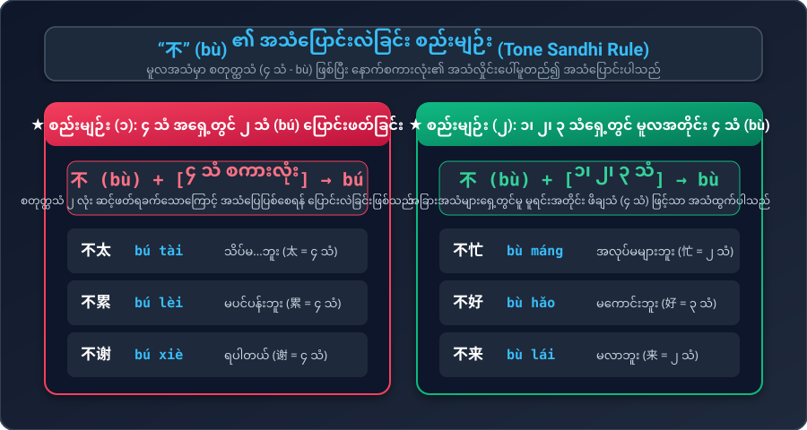
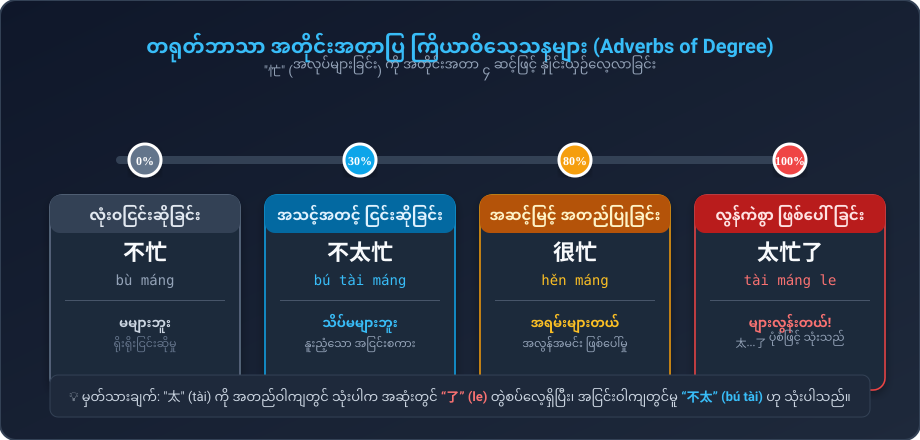
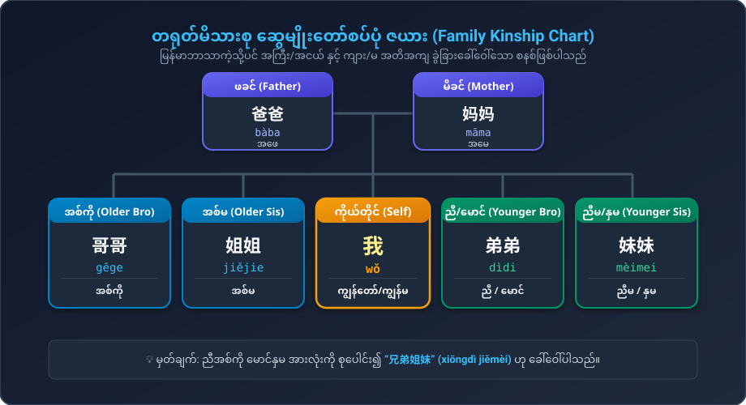

# 第三课：你工作忙吗？(သင်ခန်းစာ ၃ - မင်း အလုပ်များလား)
### တရုတ်စကားပြော အခြေခံသင်ခန်းစာ (မြန်မာသင်သားများအတွက် အထူးပြုပြင်ရေးသားချက်)

---

## ၁။ သင်ခန်းစာ (၃) အခြေခံ ဝါကျကြီး (၄) ခု (Key Sentences)

| # | တရုတ်စာလုံး (Hanzi) | ဖျင်းယင်း (Pinyin) | မြန်မာအသံထွက် | မြန်မာအဓိပ္ပာယ် |
|---|---|---|---|---|
| **009** | **你工作忙吗？** | nǐ gōngzuò máng ma? | **နီ ကုန်းဇို့ မာင် မာ** | မင်း အလုပ်များလားခင်ဗျာ/ရှင့်? |
| **010** | **很忙，你呢？** | hěn máng, nǐ ne? | **ဟန် မာင်၊ နီ နာ** | အရမ်းများတယ်၊ မင်းရော? |
| **011** | **我不太忙。** | wǒ bú tài máng. | **ဝေါ် ပူး ထိုက် မာင်** | ကျွန်တော်/ကျွန်မ သိပ်မများပါဘူး |
| **012** | **你爸爸、妈妈身体好吗？** | nǐ bàba, māma shēntǐ hǎo ma? | **နီ ပါးပ၊ မားမ ရှန်းထီ ဟောင် မာ** | မင်းရဲ့ ဖေဖေနဲ့ မေမေ ကျန်းမာရေး ကောင်းရဲ့လား? |

---

## ၂။ လက်တွေ့ စကားပြောခန်းများ (Conversations)

### စကားပြောခန်း (၁) : ဆရာနှစ်ဦး အလုပ်အကိုင် မေးမြန်းခြင်း
* **李老师 (လီဆရာ):** 你好！
  * ဖျင်းယင်း: *Nǐ hǎo!*
  * မြန်မာအသံထွက်: **နီ ဟောင်**
  * အဓိပ္ပာယ်: မင်္ဂလာပါ!
* **张老师 (ကျန်းဆရာ):** 你好！
  * ဖျင်းယင်း: *Nǐ hǎo!*
  * မြန်မာအသံထွက်: **နီ ဟောင်**
  * အဓိပ္ပာယ်: မင်္ဂလာပါ!
* **李老师 (လီဆရာ):** 你工作忙吗？
  * ဖျင်းယင်း: *Nǐ gōngzuò máng ma?*
  * မြန်မာအသံထွက်: **နီ ကုန်းဇို့ မာင် မာ**
  * အဓိပ္ပာယ်: ဆရာ အလုပ်တွေ အရမ်းများနေလား?
* **张老师 (ကျန်းဆရာ):** 很忙，你呢？
  * ဖျင်းယင်း: *Hěn máng, nǐ ne?*
  * မြန်မာအသံထွက်: **ဟန် မာင်၊ နီ နာ**
  * အဓိပ္ပာယ်: တော်တော်လေး များတယ်ဗျာ၊ ဆရာရော?
* **李老师 (လီဆရာ):** 我不太忙。
  * ဖျင်းယင်း: *Wǒ bú tài máng.*
  * မြန်မာအသံထွက်: **ဝေါ် ပူး ထိုက် မာင်**
  * အဓိပ္ပာယ်: ကျွန်တော် သိပ်မများလှပါဘူး။

---

### စကားပြောခန်း (၂) : ဆရာနှင့် ကျောင်းသားများ
* **大卫 (ဒါဝိဒ်):** 老师，您早！
  * ဖျင်းယင်း: *Lǎoshī, nín zǎo!*
  * မြန်မာအသံထွက်: **လောင်ရှီး၊ နင် ဇောင်**
  * အဓိပ္ပာယ်: ဆရာ၊ မင်္ဂလာနံနက်ခင်းပါ!
* **玛丽 (မာရီ):** 老师好！
  * ဖျင်းယင်း: *Lǎoshī hǎo!*
  * မြန်မာအသံထွက်: **လောင်ရှီး ဟောင်**
  * အဓိပ္ပာယ်: ဆရာ မင်္ဂလာပါရှင်!
* **张老师 (ကျန်းဆရာ):** 你们好！
  * ဖျင်းယင်း: *Nǐmen hǎo!*
  * မြန်မာအသံထွက်: **နီမန် ဟောင်**
  * အဓိပ္ပာယ်: မင်းတို့ အားလုံး မင်္ဂလာပါ!
* **大卫 (ဒါဝိဒ်):** 老师忙吗？
  * ဖျင်းယင်း: *Lǎoshī máng ma?*
  * မြန်မာအသံထွက်: **လောင်ရှီး မာင် မာ**
  * အဓိပ္ပာယ်: ဆရာ အလုပ်ရှုပ်နေပါသလားခင်ဗျာ?
* **张老师 (ကျန်းဆရာ):** 很忙，你们呢？
  * ဖျင်းယင်း: *Hěn máng, nǐmen ne?*
  * မြန်မာအသံထွက်: **ဟန် မာင်၊ နီမန် နာ**
  * အဓိပ္ပာယ်: အရမ်းများတယ်၊ မင်းတို့ရော?
* **大卫 (ဒါဝိဒ်):** 我不忙。
  * ဖျင်းယင်း: *Wǒ bù máng.*
  * မြန်မာအသံထွက်: **ဝေါ် ပူ့ မာင်**
  * အဓိပ္ပာယ်: ကျွန်တော် အလုပ်မများပါဘူး။
* **玛丽 (မာရီ):** 我也不忙。
  * ဖျင်းယင်း: *Wǒ yě bù máng.*
  * မြန်မာအသံထွက်: **ဝေါ် ရယ် ပူ့ မာင်**
  * အဓိပ္ပာယ်: ကျွန်မလည်း အလုပ်မများပါဘူးရှင်။

---

### စကားပြောခန်း (၃) : သူငယ်ချင်း မိသားစု ကျန်းမာရေး မေးမြန်းခြင်း
* **王兰 (ဝမ်လန်):** 刘京，你好！
  * ဖျင်းယင်း: *Liú Jīng, nǐ hǎo!*
  * မြန်မာအသံထွက်: **လျူကျင်း၊ နီ ဟောင်**
  * အဓိပ္ပာယ်: လျူကျင်း၊ မင်္ဂလာပါ!
* **刘京 (လျူကျင်း):** 你好！
  * ဖျင်းယင်း: *Nǐ hǎo!*
  * မြန်မာအသံထွက်: **နီ ဟောင်**
  * အဓိပ္ပာယ်: မင်္ဂလာပါ!
* **王兰 (ဝမ်လန်):** 你爸爸、妈妈身体好吗？
  * ဖျင်းယင်း: *Nǐ bàba, māma shēntǐ hǎo ma?*
  * မြန်မာအသံထွက်: **နီ ပါးပ၊ မားမ ရှန်းထီ ဟောင် မာ**
  * အဓိပ္ပာယ်: မင်းရဲ့ အဖေနဲ့ အမေ ကျန်းမာရေး ကောင်းရဲ့လားရှင့်?
* **刘京 (လျူကျင်း):** 他们都很好。谢谢！
  * ဖျင်းယင်း: *Tāmen dōu hěn hǎo. Xièxie!*
  * မြန်မာအသံထွက်: **ထာမန် သိုး ဟန် ဟောင်။ ရှဲ့ရှဲ့**
  * အဓိပ္ပာယ်: သူတို့ နှစ်ယောက်စလုံး အရမ်းနေကောင်းကြပါတယ်။ ကျေးဇူးတင်ပါတယ်!

---

## ၃။ မြန်မာသင်သားများအတွက် အထူးသဒ္ဒါရှင်းလင်းချက် (Grammar Clinic)

### (က) “不” (bù) ၏ အသံပြောင်းလဲခြင်း စည်းမျဉ်း (Tone Sandhi Rule)

* **စည်းမျဉ်း (၁):** `不` နောက်တွင် **စတုတ္ထသံ (၄ သံ)** လိုက်ပါက `不` ကို **ဒုတိယသံ (bú)** အဖြစ် အသံပြောင်းဖတ်ရသည်။
  * ဥပမာ: `不` + `太 (၄ သံ)` $\to$ **不太 (bú tài)** [သိပ်မ...ဘူး]
  * ဥပမာ: `不` + `累 (၄ သံ)` $\to$ **不累 (bú lèi)** [မပင်ပန်းဘူး]
  * ဥပမာ: `不` + `谢 (၄ သံ)` $\to$ **不谢 (bú xiè)** [ရပါတယ်/ကျေးဇူးတင်မနေပါနဲ့]
* **စည်းမျဉ်း (၂):** `不` နောက်တွင် **၁ သံ၊ ၂ သံ၊ ၃ သံ** လိုက်ပါက မူလအတိုင်း **စတုတ္ထသံ (bù)** ဖြင့်သာ ဖတ်ရသည်။
  * ဥပမာ: `不` + `忙 (၂ သံ)` $\to$ **不忙 (bù máng)** [အလုပ်မများဘူး]
  * ဥပမာ: `不` + `好 (၃ သံ)` $\to$ **不好 (bù hǎo)** [မကောင်းဘူး]

---

### (ခ) ပြတ်တောင်း အမေးပစ္စည်း: “呢” (ne) — "...ကော? / ...ရော?"
* အရှေ့ဝါကျ၏ အခြေအနေ/မေးခွန်းကို နာမ် (သို့) နာမ်စား နောက်တွင် `呢` ကပ်ရုံဖြင့် ထပ်မံမေးမြန်းနိုင်ပါသည်။
  * ဥပမာ: **我很忙，你呢？** (Wǒ hěn máng, nǐ ne?) $\to$ ကျွန်တော် အရမ်းအလုပ်များတယ်၊ **မင်းရော (အလုပ်များလား)?**
  * ဥပမာ: **我身体很好，你呢？** (Wǒ shēntǐ hěn hǎo, nǐ ne?) $\to$ ကျွန်တော့်ကျန်းမာရေးကောင်းတယ်၊ **မင်းကော?**

---

### (ဂ) အတိုင်းအတာပြ ကြိယာဝိသေသန ၄ ဆင့် (Degree Scale)

| အဆင့် | စကားလုံး | ဖျင်းယင်း | မြန်မာအဓိပ္ပာယ် | သုံးစွဲပုံ ဥပမာ |
|---|---|---|---|---|
| **0% (ငြင်းပယ်)** | **不** | bù | မ...ဘူး | 我不忙 (ငါ အလုပ်မများဘူး) |
| **30% (အသင့်အတင့်)** | **不太** | bú tài | သိပ်မ...ဘူး | 我不太忙 (ငါ သိပ်အလုပ်မများဘူး) |
| **80% (အတည်ပြု)** | **很** | hěn | အရမ်း... | 我很忙 (ငါ အရမ်းအလုပ်များတယ်) |
| **100%+ (လွန်ကဲ)** | **太...了** | tài...le | ...လွန်းတယ် | 我太忙了 (ငါ အလုပ်တွေ များလွန်းတယ်) |

---

### (ဃ) တရုတ်မိသားစု ဆွေမျိုးတော်စပ်ပုံ အခေါ်အဝေါ်များ

* မြန်မာဘာသာကဲ့သို့ပင် တရုတ်ဘာသာတွင် အကြီး/အငယ် အတိအကျ ခွဲခြားပါသည်။
  * **အဖေ/မိခင်:** 爸爸 (bàba), 妈妈 (māma)
  * **အကြီးများ:** 哥哥 (gēge - အစ်ကို), 姐姐 (jiějie - အစ်မ)
  * **အငယ်များ:** 弟弟 (dìdi - ညီ/မောင်), 妹妹 (mèimei - ညီမ/နှမ)
  * **စုပေါင်းခေါ်ဝေါ်မှု:** 兄弟姐妹 (xiōngdì jiěmèi - ညီအစ်ကို မောင်နှမများ)

---

## ၄။ ဝေါဟာရ စာရင်းအပြည့်အစုံ (Full Vocabulary)

| # | တရုတ်စာလုံး | ဖျင်းယင်း | မြန်မာအသံထွက် | အဓိပ္ပာယ် | အမျိုးအစား |
|---|---|---|---|---|---|
| 1 | **工作** | gōngzuò | ကုန်းဇို့ | အလုပ် / အလုပ်လုပ်သည် | ကြိယာ / နာမ် |
| 2 | **忙** | máng | မာင် | အလုပ်များသော | နာမဝိသေသန |
| 3 | **呢** | ne | နာ | ...ကော? / ...ရော? | အမေးပစ္စည်း |
| 4 | **不** | bù / bú | ပူ့ / ပူး | မဟုတ် / မ...ဘူး | အငြင်းစကားလုံး |
| 5 | **太** | tài | ထိုက် | သိပ် / အလွန် / လွန်ကဲစွာ | ကြိယာဝိသေသန |
| 6 | **累** | lèi | လေ့ | မောပန်း / ပင်ပန်းသော | နာမဝိသေသန |
| 7 | **哥哥** | gēge | ကောကော | အစ်ကို | နာမ် |
| 8 | **姐姐** | jiějie | ကျယ်ကျယ် | အစ်မ | နာမ် |
| 9 | **弟弟** | dìdi | သီးသီ | ညီ / မောင် | နာမ် |
| 10 | **妹妹** | mèimei | မေ့မေ | ညီမ / နှမ | နာမ် |
| 11 | **爸爸** | bàba | ပါးပ | အဖေ | နာမ် |
| 12 | **妈妈** | māma | မားမ | အမေ | နာမ် |
| 13 | **月** | yuè | ယွဲ့ | လ (Month / Moon) | နာမ် |
| 14 | **明天** | míngtiān | မင်ထျန်း | မနက်ဖြန် | အချိန်ပြနာမ် |
| 15 | **今天** | jīntiān | ကျင်းထျန်း | ဒီနေ့ | အချိန်ပြနာမ် |
| 16 | **今年** | jīnnián | ကျင်းညန် | ဒီနှစ် | အချိန်ပြနာမ် |
| 17 | **明年** | míngnián | မင်ညန် | နောက်နှစ် | အချိန်ပြနာမ် |
| 18 | **零 (〇)** | líng | လင် | သုည (0) | ဂဏန်း |
| 19 | **年** | nián | ညန် | နှစ် (Year) | နာမ် |

---

## ၅။ အသုံးချ လေ့ကျင့်ခန်းများ (Exercises)

1. **"ငါ သိပ်မပင်ပန်းဘူး"** ကို တရုတ်လို မည်သို့ ပြောမည်နည်း?  
   👉 *အဖြေ:* **我不太累。** (Wǒ bú tài lèi.)
2. **"不" ၏ အသံပြောင်းပုံ:** "不太" တွင် "不" ကို မည်သည့်အသံဖြင့် ဖတ်ရမည်နည်း?  
   👉 *အဖြေ:* **bú** (ဒုတိယသံ - နောက်စကားလုံး 太 မှာ ၄ သံ ဖြစ်သောကြောင့်)
3. **"မင်းတို့ အားလုံး အလုပ်များလား?"** ကို တရုတ်လို မည်သို့ မေးမည်နည်း?  
   👉 *အဖြေ:* **你们都忙吗？** (Nǐmen dōu máng ma?)
