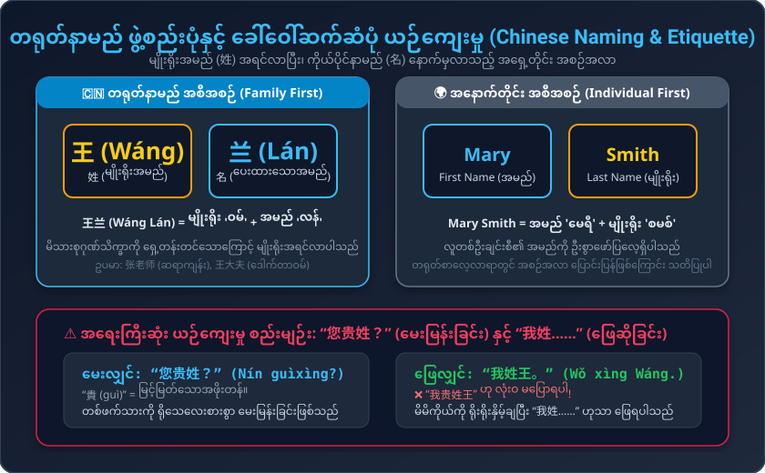
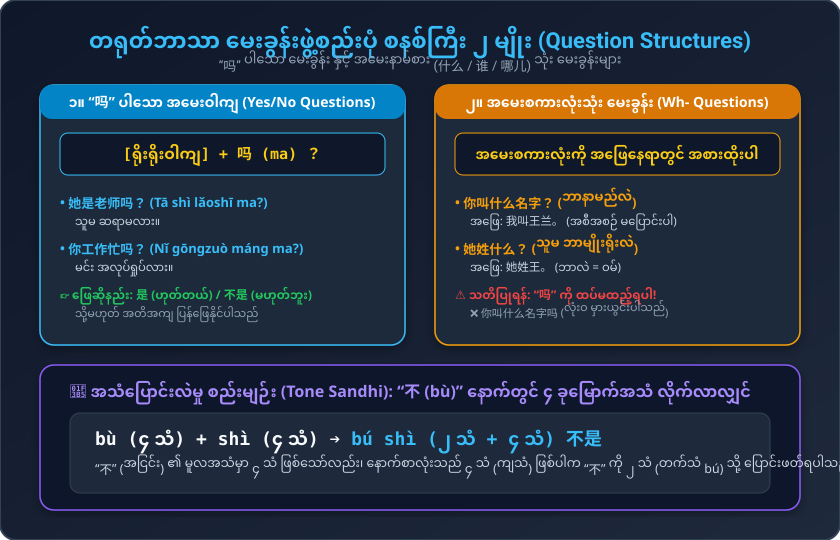

# သင်ခန်းစာ (၄) : သင့်မျိုးရိုးအမည် မည်သို့ခေါ်ပါသလဲ (第四课：您贵姓？)
### Conversational Chinese 301 - Lesson 04 Complete Burmese Study Guide

---

## ၁။ အဓိက ဝါကျကြီး (၆) ခု (Key Sentences 013 - 018)

1. **我叫玛丽。**  
   * Pinyin: `Wǒ jiào Mǎlì.`  
   * မြန်မာအသံထွက်: **ဝေါ် ကျောက် မာလိ**  
   * အဓိပ္ပာယ်: ကျွန်မနာမည် မာရီ ဖြစ်ပါတယ်။

2. **认识你，我很高兴。**  
   * Pinyin: `Rènshi nǐ, wǒ hěn gāoxìng.`  
   * မြန်မာအသံထွက်: **ရိန့်ရှီ နီ၊ ဝေါ် ဟန် ကောင်းရှင်း**  
   * အဓိပ္ပာယ်: မင်းနဲ့ သိကျွမ်းရတာ အရမ်းဝမ်းသာပါတယ်။

3. **您贵姓？**  
   * Pinyin: `Nín guìxìng?`  
   * မြန်မာအသံထွက်: **နင် ကွေ့ဆင့်?**  
   * အဓိပ္ပာယ်: လူကြီးမင်းရဲ့ မြင့်မြတ်သော မျိုးရိုးအမည် ဘယ်လိုခေါ်ပါသလဲခင်ဗျာ/ရှင့်။ (အလွန်ယဉ်ကျေးသော အသုံး)

4. **你叫什么名字？**  
   * Pinyin: `Nǐ jiào shénme míngzi?`  
   * မြန်မာအသံထွက်: **နီ ကျောက် ရှန်မ မင်ကျီ?**  
   * အဓိပ္ပာယ်: မင်းနာမည် ဘာခေါ်လဲ / မင်းနာမည် ဘယ်လိုခေါ်ပါသလဲ။

5. **她姓什么？**  
   * Pinyin: `Tā xìng shénme?`  
   * မြန်မာအသံထွက်: **ထာ ဆင့် ရှန်မ?**  
   * အဓိပ္ပာယ်: သူမရဲ့ မျိုးရိုးအမည်က ဘာလဲ။

6. **她不是老师，她是学生。**  
   * Pinyin: `Tā bú shì lǎoshī, tā shì xuésheng.`  
   * မြန်မာအသံထွက်: **ထာ ပု ရှီး လောက်ရှီး၊ ထာ ရှီး ရွှဲရှန်း**  
   * အဓိပ္ပာယ်: သူမ ဆရာမ မဟုတ်ပါဘူး၊ ကျောင်းသူ ဖြစ်ပါတယ်။

---

## ၂။ လက်တွေ့ စကားပြောဆိုမှုများ (Conversations)

### စကားပြော (၁) : ရွယ်တူချင်း မိတ်ဆက်ခြင်း (Meeting a Peer)
* **玛丽:** 我叫玛丽，你姓什么？  
  * Pinyin: `Wǒ jiào Mǎlì, nǐ xìng shénme?`  
  * မြန်မာအသံထွက်: ဝေါ် ကျောက် မာလိ၊ နီ ဆင့် ရှန်မ?  
  * အဓိပ္ပာယ်: ကျွန်မနာမည် မာရီပါ၊ မင်းရဲ့ မျိုးရိုးအမည်က ဘာလဲ။
* **王兰:** 我姓王，我叫王兰。  
  * Pinyin: `Wǒ xìng Wáng, wǒ jiào Wáng Lán.`  
  * မြန်မာအသံထွက်: ဝေါ် ဆင့် ဝမ်၊ ဝေါ် ကျောက် ဝမ်လန်။  
  * အဓိပ္ပာယ်: ကျွန်မ မျိုးရိုးက 'ဝမ်' ပါ၊ နာမည်က ဝမ်လန် ဖြစ်ပါတယ်။
* **玛丽:** 认识你，我很高兴。  
  * Pinyin: `Rènshi nǐ, wǒ hěn gāoxìng.`  
  * မြန်မာအသံထွက်: ရိန့်ရှီ နီ၊ ဝေါ် ဟန် ကောင်းရှင်း။  
  * အဓိပ္ပာယ်: မင်းနဲ့ သိကျွမ်းခွင့်ရတာ အရမ်းဝမ်းသာပါတယ်။
* **王兰:** 认识你，我也很高兴。  
  * Pinyin: `Rènshi nǐ, wǒ yě hěn gāoxìng.`  
  * မြန်မာအသံထွက်: ရိန့်ရှီ နီ၊ ဝေါ် ရယ် ဟန် ကောင်းရှင်း။  
  * အဓိပ္ပာယ်: မင်းနဲ့ သိကျွမ်းခွင့်ရတာ ကျွန်မလည်း အရမ်းဝမ်းသာပါတယ်။

---

### စကားပြော (၂) : ဆရာ/လူကြီးနှင့် ယဉ်ကျေးစွာ စကားပြောဆိုခြင်း (Polite Conversation with Teacher)
* **大卫:** 老师，您贵姓？  
  * Pinyin: `Lǎoshī, nín guìxìng?`  
  * မြန်မာအသံထွက်: လောက်ရှီး၊ နင် ကွေ့ဆင့်?  
  * အဓိပ္ပာယ်: ဆရာရှင့်/ခင်ဗျာ၊ ဆရာ့ရဲ့ မျိုးရိုးအမည်ကို သိခွင့်ပြုပါ (လူကြီးမင်း မျိုးရိုးအမည် ဘယ်လိုခေါ်ပါသလဲ)။
* **张老师:** 我姓张。你叫什么名字？  
  * Pinyin: `Wǒ xìng Zhāng. Nǐ jiào shénme míngzi?`  
  * မြန်မာအသံထွက်: ဝေါ် ဆင့် ကျန်း။ နီ ကျောက် ရှန်မ မင်ကျီ?  
  * အဓိပ္ပာယ်: ငါ့မျိုးရိုးက 'ကျန်း' ပါ။ မင်းနာမည် ဘယ်လိုခေါ်လဲ။
* **大卫:** 我叫大卫。她姓什么？  
  * Pinyin: `Wǒ jiào Dàwèi. Tā xìng shénme?`  
  * မြန်မာအသံထွက်: ဝေါ် ကျောက် သာဝေ့။ ထာ ဆင့် ရှန်မ?  
  * အဓိပ္ပာယ်: ကျွန်တော့်နာမည် ဒေးဗစ် (သာဝေ့) ပါ။ ဟိုတစ်ယောက် (သူမ) ရဲ့ မျိုးရိုးက ဘာလဲခင်ဗျာ။
* **张老师:** 她姓王。  
  * Pinyin: `Tā xìng Wáng.`  
  * မြန်မာအသံထွက်: ထာ ဆင့် ဝမ်။  
  * အဓိပ္ပာယ်: သူမရဲ့ မျိုးရိုးက 'ဝမ်' ပါ။
* **大卫:** 她是老师吗？  
  * Pinyin: `Tā shì lǎoshī ma?`  
  * မြန်မာအသံထွက်: ထာ ရှီး လောက်ရှီး မာ?  
  * အဓိပ္ပာယ်: သူမက ဆရာမလား ခင်ဗျာ။
* **张老师:** 她不是老师，她是学生。  
  * Pinyin: `Tā bú shì lǎoshī, tā shì xuésheng.`  
  * မြန်မာအသံထွက်: ထာ ပု ရှီး လောက်ရှီး၊ ထာ ရှီး ရွှဲရှန်း။  
  * အဓိပ္ပာယ်: သူမ ဆရာမ မဟုတ်ပါဘူး၊ ကျောင်းသူ ဖြစ်ပါတယ်။

---

## ၃။ တရုတ်နာမည် ဖွဲ့စည်းပုံနှင့် ယဉ်ကျေးမှု မှတ်စုများ

1. **မျိုးရိုးအမည် (姓) အရင်လာသည်:**  
   * တရုတ်အမည်များတွင် မိသားစုမျိုးရိုးအမည် (姓 - Xìng) သည် အမြဲ ရှေ့ဆုံးမှ လာပြီး၊ ပေးထားသောအမည် (名 - Míng) သည် နောက်မှ လာပါသည်။  
   * ဥပမာ: **王兰 (Wáng Lán)** $\to$ 王 (ဝမ် - မျိုးရိုး) + 兰 (လန် - အမည်)။  
   * ဆရာ/ဆရာမ သို့မဟုတ် ရာထူးဖြင့် ခေါ်ဆိုလျှင် မျိုးရိုးကို ရှေ့မှထား၍ **张老师 (ဆရာကျန်း)**၊ **王大夫 (ဒေါက်တာဝမ်)** ဟု ခေါ်ဝေါ်ရပါသည် (အမည်ရင်းဖြင့် မခေါ်ပါ)။

2. **“您贵姓？” နှင့် “我姓……” စည်းမျဉ်း:**  
   * **“贵姓” (guìxìng):** တစ်ဖက်သားကို ရိုသေလေးစားသောအားဖြင့် မေးမြန်းခြင်းဖြစ်သောကြောင့် **ဒုတိယလူ (သင်/လူကြီးမင်း)** အား မေးမြန်းရာတွင်သာ သုံးရသည်။  
   * မိမိကိုယ်ကို ဖြေဆိုရာတွင် မည်သည့်အခါမျှ “我贵姓……” ဟု မသုံးရပါ!  
   * အမြဲတမ်း ရိုးရိုးနှိမ့်ချပြီး **“我姓王”** (ကျွန်တော့်မျိုးရိုးက ဝမ်ပါ) ဟုသာ ဖြေဆိုရပါမည်။

---

## ၄။ သဒ္ဒါစည်းမျဉ်းများ (Grammar Points)

### (က) “吗 (ma)” ပါသော အထွေထွေ အမေးဝါကျ (Yes/No Questions)
ရိုးရိုးဝါကျ၏ အဆုံးတွင် “吗” ထည့်လိုက်ရုံဖြင့် အမေးဝါကျ ဖြစ်လာပါသည်:
* 她是老师。 (သူမ ဆရာမ ဖြစ်သည်။) $\to$ **她是老师吗？** (သူမ ဆရာမလား။)
* ဖြေဆိုရာတွင်: **是** (ဟုတ်သည်) သို့မဟုတ် **不是** (မဟုတ်ပါ) ဟု ဖြေနိုင်သည်။

### (ခ) အမေးနာမ်စား (Interrogative Pronouns) သုံး မေးခွန်းများ
တရုတ်ဘာသာတွင် အမေးစကားလုံး (什么 = ဘာလဲ, 谁 = ဘယ်သူလဲ, 哪儿 = ဘယ်နေရာလဲ) ကို သုံးသောအခါ အင်္ဂလိပ်စာကဲ့သို့ စကားလုံးအစီအစဉ်ကို ပြောင်းပြန်မလှန်ရပါ! အဖြေနေရာတွင် အမေးစကားလုံးကို တိုက်ရိုက် အစားထိုးရုံသာ ဖြစ်ပါသည်:
* 她姓**王**。 $\to$ 她姓**什么**？ (သူမ ဘာမျိုးရိုးလဲ။)
* 我叫**王兰**。 $\to$ 你叫**什么**名字？ (မင်း ဘာနာမည်လဲ။)
* **သတိပြုရန်:** အမေးစကားလုံးပါပြီးပါက ဝါကျအဆုံးတွင် **“吗” ကို လုံးဝ ထပ်မထည့်ရပါ**!

### (ဂ) “不” ၏ အသံပြောင်းလဲမှု စည်းမျဉ်း (Tone Sandhi)
* “不” (bù) သည် မူလက ၄ ခုမြောက်အသံ (ကျသံ) ဖြစ်သည်။
* သို့သော် နောက်စာလုံးသည်လည်း ၄ ခုမြောက်အသံ ဖြစ်နေပါက “不” ကို ၂ ခုမြောက်အသံ (တက်သံ bú) သို့ ပြောင်းဖတ်ရသည်:
  * bù + shì $\to$ **bú shì (不是 - မဟုတ်ပါ)**
  * bù + tài $\to$ **bú tài (不太 - သိပ်မ...ပါ)**

---

## ၅။ ဝေါဟာရ စာရင်းသစ် (New Vocabulary)

| # | စာလုံး | ဖျင်းယင်း | မြန်မာအသံထွက် | အဓိပ္ပာယ် | အစိတ်အပိုင်း / ရှင်းလင်းချက် |
|---|---|---|---|---|---|
| 1 | **叫** | jiào | ကျောက် | ခေါ်သည် / နာမည်ဖြစ်သည် | 口 (ပါးစပ်) ပေါင်းစပ် |
| 2 | **认识** | rènshi | ရိန့်ရှီ | သိကျွမ်းသည် / ခင်မင်သည် | 讠 (စကား) + 认, 识 |
| 3 | **高兴** | gāoxìng | ကောင်းရှင်း | ဝမ်းသာသော / ပျော်သော | 高 (မြင့်) + 兴 (စိတ်အားထက်သန်) |
| 4 | **贵姓** | guìxìng | ကွေ့ဆင့် | (ယဉ်ကျေး) မျိုးရိုးအမည် | 贵 (မြင့်မြတ်သော) + 姓 |
| 5 | **贵** | guì | ကွေ့ | မြင့်မြတ်သော / တန်ဖိုးကြီးသော | 贝 (ရတနာ/ခရုခွံ) ပါဝင် |
| 6 | **姓** | xìng | ဆင့် | မျိုးရိုးအမည် / မျိုးရိုးရှိသည် | 女 (အမျိုးသမီး) + 生 (မွေးဖွား) |
| 7 | **什么** | shénme | ရှန်မ | ဘာလဲ / အဘယ်အရာ | အမေးစကားလုံး |
| 8 | **名字** | míngzi | မင်ကျီ | နာမည် | 名 (အမည်) + 字 (စာလုံး) |
| 9 | **是** | shì | ရှီး | ဖြစ်သည် / ဟုတ်သည် | ကြိယာ (verb to be) |
| 10 | **不是** | bú shì | ပု ရှီး | မဟုတ်ပါ | Tone Sandhi: bú + shì |
| 11 | **学生** | xuésheng | ရွှဲရှန်း | ကျောင်းသား / ကျောင်းသူ | 学 (လေ့လာ) + 生 (လူ) |
| 12 | **那** | nà | နာ့ | ထို / ဟို | အဝေးညွှန်း နာမ်စား |
| 13 | **个** | gè | က | ခု / ယောက် | လူနှင့် အရာဝတ္ထုပြ အရေအတွက်ပြပုဒ် |
| 14 | **那个** | nà ge | နာ့က | ဟိုတစ်ခု / ဟိုလူ | ထိုအရာ |
| 15 | **这** | zhè | ကျဲ့ | ဤ / ဒီ | အနီးညွှန်း နာမ်စား |
| 16 | **这个** | zhè ge | ကျဲ့က | ဒီတစ်ခု / ဒီလူ | ဤအရာ |
| 17 | **人** | rén | ရန် | လူ | လူပုံစံ ရုပ်ပုံစာလုံး |
| 18 | **大夫** | dàifu | သိုက်ဖူ | ဆရာဝန် (သမားတော်) | တရုတ်ရိုးရာ ဆရာဝန်အခေါ် |
| 19 | **留学生** | liúxuéshēng | လျိုရွှဲရှန်း | နိုင်ငံခြားကျောင်းသား | 留 (နေထိုင်) + 学 (သင်) + 生 |
| 20 | **朋友** | péngyou | ဖုန်ရို | သူငယ်ချင်း / မိတ်ဆွေ | 月 (အဖော်) နှစ်ခုတွဲ |
| 21 | **老师** | lǎoshī | လောက်ရှီး | ဆရာ / ဆရာမ | 老 (လေးစားထိုက်သော) + 师 |
| 22 | **谁** | shéi / shuí | ရှေ / ရွှေ | ဘယ်သူလဲ | အမေးစကားလုံး (Who) |
| 23 | **哪儿** | nǎr | နာရ် | ဘယ်နေရာလဲ | အမေးစကားလုံး (Where) |
| 24 | **美国** | Měiguó | မေကော် | အမေရိကန်နိုင်ငံ | 美 (လှပသော) + 国 (နိုင်ငံ) |
| 25 | **美国人** | Měiguó rén | မေကော်ရန် | အမေရိကန်လူမျိုး | နိုင်ငံ + 人 |

---

## ၆။ အသံထွက် လေ့ကျင့်ခန်းများ (Phonetic Drills)

### (က) ပထမအသံ + ပထမအသံ တွဲဖတ်ခြင်း (1st tone + 1st tone combos)
ပထမသံနှစ်ခု ဆက်တိုက်လာလျှင် အသံကို ညီညာစွာ ပြားပြားဆွဲ၍ ဖတ်ရပါသည်:
* **飞机** (fēijī) - လေယာဉ်ပျံ
* **参加** (cānjiā) - ပါဝင်တက်ရောက်သည်
* **发生** (fāshēng) - ဖြစ်ပွားသည်
* **秋天** (qiūtiān) - ဆောင်းဦးရာသီ
* **春天** (chūntiān) - နွေဦးရာသီ
* **星期** (xīngqī) - ရက်သတ္တပတ်
* **应该** (yīnggāi) - သင့်လျော်သည် / သင့်သည်
* **关心** (guānxīn) - ဂရုစိုက်သည်
