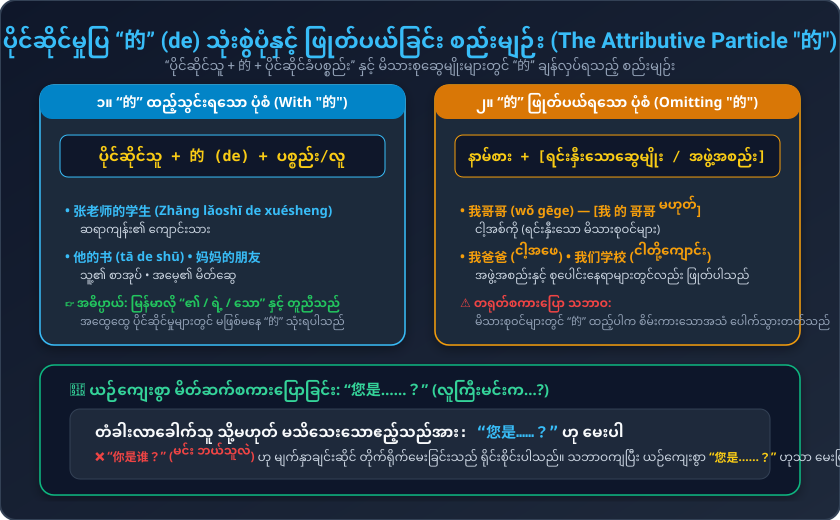
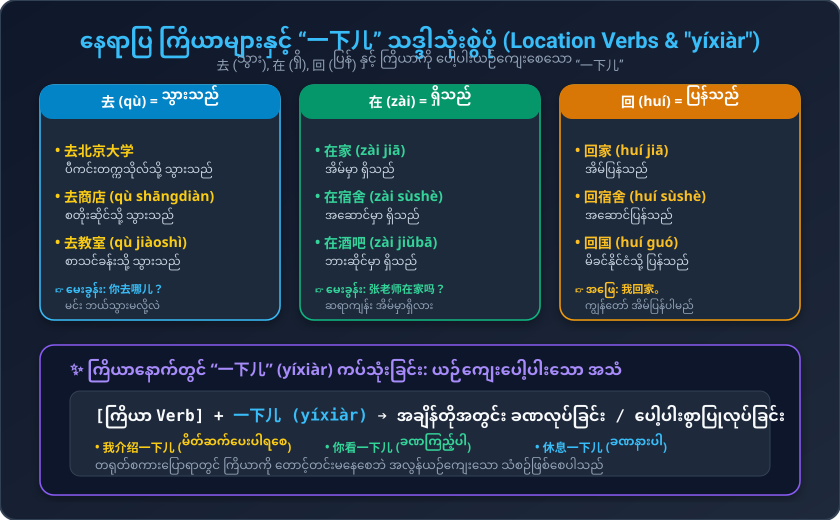

# သင်ခန်းစာ (၅) : ကျွန်မ မိတ်ဆက်ပေးပါရစေ (第五课：我介绍一下儿)
### Conversational Chinese 301 - Lesson 05 Complete Burmese Study Guide (Unit 1 Milestone)

---

## ၁။ အဓိက ဝါကျကြီး (၆) ခု (Key Sentences 019 - 024)

1. **他是谁？**  
   * Pinyin: `Tā shì shéi?`  
   * မြန်မာအသံထွက်: **ထာ ရှီး ရှေ?**  
   * အဓိပ္ပာယ်: သူ ဘယ်သူလဲခင်ဗျာ/ရှင့်။

2. **我介绍一下儿。**  
   * Pinyin: `Wǒ jièshào yíxiàr.`  
   * မြန်မာအသံထွက်: **ဝေါ် ကျဲ့ရှောက် ရီရှာရ်**  
   * အဓိပ္ပာယ်: ကျွန်မ/ကျွန်တော် မိတ်ဆက်ပေးပါရစေ။

3. **你去哪儿？**  
   * Pinyin: `Nǐ qù nǎr?`  
   * မြန်မာအသံထွက်: **နီ ချွိ နာရ်?**  
   * အဓိပ္ပာယ်: မင်း ဘယ်သွားမလို့လဲ။

4. **张老师在家吗？**  
   * Pinyin: `Zhāng lǎoshī zài jiā ma?`  
   * မြန်မာအသံထွက်: **ကျန်း လောက်ရှီး စိုက် ကျား မာ?**  
   * အဓိပ္ပာယ်: ဆရာကျန်း အိမ်မှာ ရှိပါသလား။

5. **我是张老师的学生。**  
   * Pinyin: `Wǒ shì Zhāng lǎoshī de xuésheng.`  
   * မြန်မာအသံထွက်: **ဝေါ် ရှီး ကျန်း လောက်ရှီး တဲ့ ရွှဲရှန်း**  
   * အဓိပ္ပာယ်: ကျွန်တော်က ဆရာကျန်းရဲ့ ကျောင်းသား ဖြစ်ပါတယ်။

6. **请进！**  
   * Pinyin: `Qǐng jìn!`  
   * မြန်မာအသံထွက်: **ချင်း ကျင့်!**  
   * အဓိပ္ပာယ်: ကြွပါခင်ဗျာ/ရှင့် (ဝင်လာပါ)။

---

## ၂။ လက်တွေ့ စကားပြောဆိုမှုများ (Conversations)

### စကားပြော (၁) : လမ်းတွင်တွေ့၍ မိတ်ဆက်ပေးခြင်း (Campus / Street Encounter)
* **玛丽:** 王兰，他是谁？  
  * Pinyin: `Wáng Lán, tā shì shéi?`  
  * မြန်မာအသံထွက်: ဝမ်လန်၊ ထာ ရှီး ရှေ?  
  * အဓိပ္ပာယ်: ဝမ်လန်၊ သူ ဘယ်သူလဲ။
* **王兰:** 玛丽，我介绍一下儿，这是我哥哥。  
  * Pinyin: `Mǎlì, wǒ jièshào yíxiàr, zhè shì wǒ gēge.`  
  * မြန်မာအသံထွက်: မာလိ၊ ဝေါ် ကျဲ့ရှောက် ရီရှာရ်၊ ကျဲ့ ရှီး ဝေါ် ကောကော။  
  * အဓိပ္ပာယ်: မာရီ၊ ငါ မိတ်ဆက်ပေးပါရစေ၊ ဒါ ငါ့အစ်ကိုပါ။
* **王林:** 我叫王林。认识你很高兴。  
  * Pinyin: `Wǒ jiào Wáng Lín. Rènshi nǐ hěn gāoxìng.`  
  * မြန်မာအသံထွက်: ဝေါ် ကျောက် ဝမ်လင်။ ရိန့်ရှီ နီ ဟန် ကောင်းရှင်း။  
  * အဓိပ္ပာယ်: ငါ့နာမည် ဝမ်လင် ခေါ်ပါတယ်။ မင်းနဲ့ သိကျွမ်းရတာ အရမ်းဝမ်းသာပါတယ်။
* **玛丽:** 认识你，我也很高兴。  
  * Pinyin: `Rènshi nǐ, wǒ yě hěn gāoxìng.`  
  * မြန်မာအသံထွက်: ရိန့်ရှီ နီ၊ ဝေါ် ရယ် ဟန် ကောင်းရှင်း။  
  * အဓိပ္ပာယ်: မင်းနဲ့ သိကျွမ်းရတာ ကျွန်မလည်း အရမ်းဝမ်းသာပါတယ်။
* **王兰:** 你去哪儿？  
  * Pinyin: `Nǐ qù nǎr?`  
  * မြန်မာအသံထွက်: နီ ချွိ နာရ်?  
  * အဓိပ္ပာယ်: မင်း ဘယ်သွားမလို့လဲ။
* **玛丽:** 我去北京大学。你们去哪儿？  
  * Pinyin: `Wǒ qù Běijīng Dàxué. Nǐmen qù nǎr?`  
  * မြန်မာအသံထွက်: ဝေါ် ချွိ ပေကျင်း တာ့ရွှဲ။ နီမန် ချွိ နာရ်?  
  * အဓိပ္ပာယ်: ငါ ပီကင်းတက္ကသိုလ် သွားမလို့ပါ။ နင်တို့ရော ဘယ်သွားမလဲ။
* **王林:** 我们去商店。  
  * Pinyin: `Wǒmen qù shāngdiàn.`  
  * မြန်မာအသံထွက်: ဝေါ်မန် ချွိ ဆန်းသျန့်။  
  * အဓိပ္ပာယ်: ငါတို့ စတိုးဆိုင် သွားမလို့ပါ။
* **玛丽:** 再见！  
  * Pinyin: `Zàijiàn!`  
  * မြန်မာအသံထွက်: စိုက်ကျန့်!  
  * အဓိပ္ပာယ်: တာတာ (နောက်မှတွေ့မယ်)!
* **王兰、王林:** 再见！  
  * Pinyin: `Zàijiàn!`  
  * မြန်မာအသံထွက်: စိုက်ကျန့်!  
  * အဓိပ္ပာယ်: နှုတ်ဆက်ပါတယ်!

---

### စကားပြော (၂) : ဆရာကျန်းအိမ်သို့ သွားရောက်လည်ပတ်ခြင်း (Visiting Teacher's Home)
* **和子:** 张老师在家吗？  
  * Pinyin: `Zhāng lǎoshī zài jiā ma?`  
  * မြန်မာအသံထွက်: ကျန်း လောက်ရှီး စိုက် ကျား မာ?  
  * အဓိပ္ပာယ်: ဆရာကျန်း အိမ်မှာ ရှိပါသလားရှင့်။
* **小英:** 在。您是……？  
  * Pinyin: `Zài. Nín shì...?`  
  * မြန်မာအသံထွက်: စိုက်။ နင် ရှီး...?  
  * အဓိပ္ပာယ်: ရှိပါတယ်ရှင်။ လူကြီးမင်းက...? (ဧည့်သည်အား ယဉ်ကျေးစွာ မေးမြန်းခြင်း)
* **和子:** 我是张老师的学生，我姓山下，叫和子。你是……？  
  * Pinyin: `Wǒ shì Zhāng lǎoshī de xuésheng, wǒ xìng Shānxià, jiào Hézǐ. Nǐ shì...?`  
  * မြန်မာအသံထွက်: ဝေါ် ရှီး ကျန်း လောက်ရှီး တဲ့ ရွှဲရှန်း၊ ဝေါ် ဆင့် ရှန်းရှာ့၊ ကျောက် ဟယ်ကျီ။ နီ ရှီး...?  
  * အဓိပ္ပာယ်: ကျွန်မ ဆရာကျန်းရဲ့ ကျောင်းသူပါ၊ မျိုးရိုးက ရှန်းရှာ့ (ယာမာရှီတာ) ပါ၊ နာမည်က ဟယ်ကျီ (ကာဇူကို) ပါ။ ညီမလေးကရော...?
* **小英:** 我叫小英。张老师是我爸爸。请进！  
  * Pinyin: `Wǒ jiào Xiǎoyīng. Zhāng lǎoshī shì wǒ bàba. Qǐng jìn!`  
  * မြန်မာအသံထွက်: ဝေါ် ကျောက် ရှောင်ယင်း။ ကျန်း လောက်ရှီး ရှီး ဝေါ် ပါ့ပ။ ချင်း ကျင့်!  
  * အဓိပ္ပာယ်: ကျွန်မနာမည် ရှောင်ယင်း ပါ။ ဆရာကျန်းက ကျွန်မရဲ့ အဖေပါ။ အထဲကို ကြွပါရှင်!
* **和子:** 谢谢！  
  * Pinyin: `Xièxie!`  
  * မြန်မာအသံထွက်: ရှဲ့ရှဲ့!  
  * အဓိပ္ပာယ်: ကျေးဇူးတင်ပါတယ်ရှင်!

---

## ၃။ အရေးကြီး သဒ္ဒါစည်းမျဉ်းများ (Grammar Notes)

### (က) ပိုင်ဆိုင်မှုပြ “的” (de) သုံးစွဲပုံနှင့် ဖြုတ်ပယ်ခြင်း
1. **ယေဘုယျ ပိုင်ဆိုင်မှု:**  
   နာမ် သို့မဟုတ် နာမ်စား နောက်တွင် `的` ထည့်ပြီး ပိုင်ဆိုင်မှုကို ပြပါသည် (မြန်မာလို `၏ / ရဲ့ / သော`)။  
   * ဥပမာ: `张老师的学生` (ဆရာကျန်း၏ ကျောင်းသား), `我的书` (ကျွန်တော့်စာအုပ်)။
2. **“的” ကို ဖြုတ်ပယ်ရသော နေရာများ:**  
   မိသားစုဆွေမျိုးများ (Kinship terms) သို့မဟုတ် မိမိပါဝင်သော စုပေါင်းအဖွဲ့အစည်းများ (Collectives) ရှေ့တွင် `的` ကို မသုံးဘဲ ချန်လှပ်ရပါသည်:  
   * `我哥哥` (ငါ့အစ်ကို - 我 的 哥哥 မဟုတ်ပါ)  
   * `我爸爸` (ငါ့အဖေ)  
   * `我们学校` (ငါတို့ကျောင်း)  
   *(တရုတ်စကားပြောတွင် မိသားစုဝင်များ၌ "的" ထည့်ပါက စိမ်းကားသောအသံ ပေါက်သွားတတ်သည်)*။

---

### (ခ) နေရာပြ ကြိယာများ: 去, 在, 回
* **去 (qù = သွားသည်) + နေရာ:** 去北京大学 (တက္ကသိုလ်သွားသည်), 去商店 (စတိုးဆိုင်သွားသည်)။
* **在 (zài = ရှိသည်/တွင်) + နေရာ:** 在家 (အိမ်မှာရှိသည်), 在宿舍 (အဆောင်မှာရှိသည်)။
* **回 (huí = ပြန်သည်) + နေရာ:** 回家 (အိမ်ပြန်သည်), 回宿舍 (အဆောင်ပြန်သည်)။

### (ဂ) ကြိယာကို ပေါ့ပါးယဉ်ကျေးစေသော “一下儿” (yíxiàr)
ကြိယာနောက်တွင် `一下儿` ထည့်သွင်းခြင်းဖြင့် လုပ်ဆောင်ချက်ကို အချိန်တိုအတွင်း ခဏပြုလုပ်ခြင်း သို့မဟုတ် ပေါ့ပါးယဉ်ကျေးစွာ ပြုမူခြင်းကို ဖော်ပြပါသည်:
* `我介绍一下儿` (ကျွန်တော် မိတ်ဆက်ပေးပါရစေ)
* `你看一下儿` (ခဏလောက် ကြည့်ပါဦး)
* `你听一下儿` (ခဏလောက် နားထောင်ပါဦး)
* `休息一下儿` (ခဏလောက် အနားယူပါ)

### (ဃ) ယဉ်ကျေးသော အမေး: “您是……？”
မသိသေးသော ဧည့်သည် သို့မဟုတ် တံခါးလာခေါက်သူကို မျက်နှာချင်းဆိုင်၍ `你是谁？` (မင်း ဘယ်သူလဲ) ဟု တိုက်ရိုက်မေးခြင်းသည် ရိုင်းစိုင်းပါသည်။ ယဉ်ကျေးသော တရုတ်လူမျိုးများသည် **`您是……？`** (လူကြီးမင်းက...?) ဟု အဆုံးမသတ်ဘဲ အသာမေးလေ့ရှိပြီး တစ်ဖက်လူက မိမိကိုယ်ကို မိတ်ဆက်ရပါသည်!

---

## ၄။ ဝေါဟာရ စာရင်းသစ် (Vocabulary List)

| # | စာလုံး | ဖျင်းယင်း | မြန်မာအသံထွက် | အဓိပ္ပာယ် | အစိတ်အပိုင်း / ရှင်းလင်းချက် |
|---|---|---|---|---|---|
| 1 | **谁** | shéi / shuí | ရှေ / ရွှေ | ဘယ်သူလဲ | 讠 (စကား) radical |
| 2 | **介绍** | jièshào | ကျဲ့ရှောက် | မိတ်ဆက်ပေးသည် | 介 + 绍 (ဆက်သွယ်ပေးသည်) |
| 3 | **一下儿** | yíxiàr | ရီရှာရ် | ခဏလောက် / အနည်းငယ် | Erhua (儿化) သံ |
| 4 | **去** | qù | ချွိ | သွားသည် | နေရာသို့ ဦးတည်သည် |
| 5 | **哪儿** | nǎr | နာရ် | ဘယ်နေရာလဲ | အမေးစကားလုံး (Where) |
| 6 | **在** | zài | စိုက် | ရှိသည် / ...တွင် | နေရာတည်ရှိမှုပြ ကြိယာ/ဝိဘတ် |
| 7 | **家** | jiā | ကျား | အိမ် / မိသားစု | 宀 (ခေါင်မိုး) + 豕 (ဝက်) |
| 8 | **的** | de | တဲ့ | ၏ / ရဲ့ (ပိုင်ဆိုင်မှု) | အထောက်အကူပြု ဝိဘတ် |
| 9 | **请** | qǐng | ချင်း | ဖိတ်ခေါ်သည် / ကြွပါ | ယဉ်ကျေးသော အသုံး (Please) |
| 10 | **进** | jìn | ကျင့် | ဝင်သည် | 辶 (လမ်းလျှောက်) radical |
| 11 | **大学** | dàxué | တာ့ရွှဲ | တက္ကသိုလ် | 大 (ကြီး) + 学 (သင်ယူ) |
| 12 | **商店** | shāngdiàn | ဆန်းသျန့် | စတိုးဆိုင် / စျေးဆိုင် | 商 (ကုန်သွယ်) + 店 (ဆိုင်) |
| 13 | **看** | kàn | ခန့် | ကြည့်သည် / ဖတ်သည် | 手 (လက်) က မျက်လုံးပေါ်အုပ်ကြည့် |
| 14 | **听** | tīng | ထင်း | နားထောင်သည် | 口 (ပါးစပ်) + 斤 |
| 15 | **休息** | xiūxi | ရှိုရှီ | အနားယူသည် | 人 (လူ) က 木 (သစ်ပင်) အောက်နား |
| 16 | **宿舍** | sùshè | စုစျဲ့ | အဆောင် (ဘော်ဒါဆောင်) | 宿 (တည်းခို) + 舍 (အိမ်) |
| 17 | **教室** | jiàoshì | ကျောက်ရှီး | စာသင်ခန်း | 教 (သင်) + 室 (အခန်း) |
| 18 | **酒吧** | jiǔbā | ကျိုပါး | ဘား / အရက်ဆိုင် | 酒 (အရက်) + 吧 (bar) |
| 19 | **超市** | chāoshì | ချောင်ရှီး | စူပါမားကတ် | 超 (ကျော်လွန်) + 市 (စျေး) |
| 20 | **回** | huí | ဟွေ | ပြန်သည် | အဝိုင်းအတွင်း ပြန်ဝင်ပုံစံ |
| 21 | **回家** | huí jiā | ဟွေ ကျား | အိမ်ပြန်သည် | 回 + 家 |
| 22 | **我们** | wǒmen | ဝေါ်မန် | ငါတို့ / ကျွန်တော်တို့ | 我 + 们 (အများကိန်း) |
| 23 | **你们** | nǐmen | နီမန် | မင်းတို့ / သင်တို့ | 你 + 们 |
| 24 | **他们** | tāmen | ထာမန် | သူတို့ | 他 + 们 |
| 25 | **北京大学** | Běijīng Dàxué | ပေကျင်း တာ့ရွှဲ | ပီကင်းတက္ကသိုလ် | နာမည်ကျော် တရုတ်တက္ကသိုလ် |
| 26 | **法国** | Fǎguó | ဖာ့ကော် | ပြင်သစ်နိုင်ငံ | France |
| 27 | **法国人** | Fǎguó rén | ဖာ့ကော်ရန် | ပြင်သစ်လူမျိုး | French |

---

## ၅။ အသံထွက် လေ့ကျင့်ခန်းများ (Phonetic Drills)

### ပထမအသံ + ဒုတိယအသံ တွဲဖတ်ခြင်း (1st tone + 2nd tone combos)
၁ သံ (ပြားပြားအမြင့် ၅-၅) မှ ၂ သံ (အောက်မှအထက်သို့ တက်သံ ၃-၅) သို့ ကူးပြောင်းဖတ်ပါ:
* **八楼** (bālóu) - ၈ လွှာ
* **工人** (gōngrén) - အလုပ်သမား
* **今年** (jīnnián) - ယခုနှစ်
* **踢球** (tīqiú) - ဘောလုံးကန်သည်
* **欢迎** (huānyíng) - ကြိုဆိုပါသည်
* **当然** (dāngrán) - သေချာတာပေါ့
* **非常** (fēicháng) - အလွန်တရာ
* **公园** (gōngyuán) - ပန်းခြံ
* **家庭** (jiātíng) - မိသားစု
