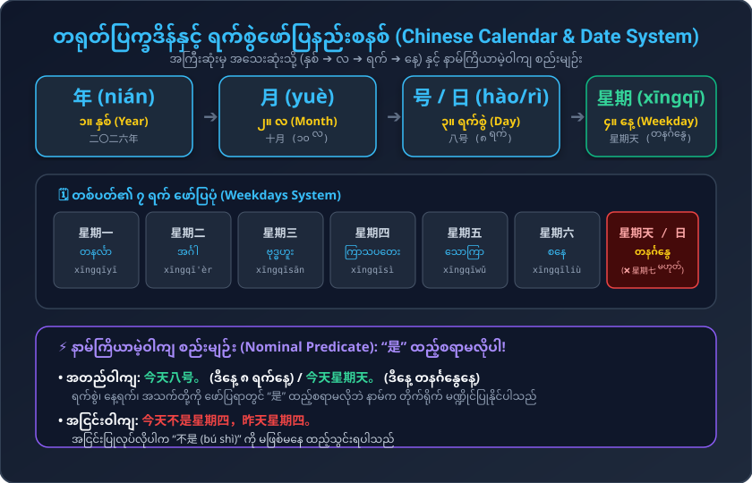
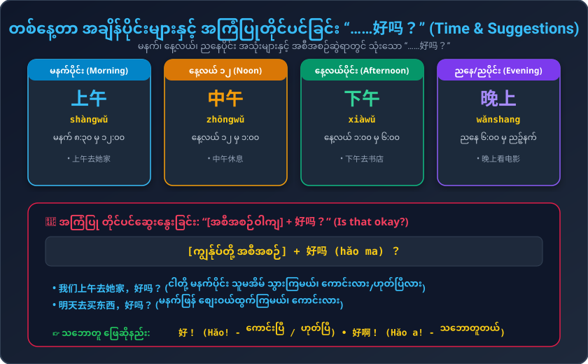

# သင်ခန်းစာ (၆) : သင့်မွေးနေ့က ဘယ်လ၊ ဘယ်ရက်လဲ (第六课：你的生日是几月几号？)
### Conversational Chinese 301 - Lesson 06 Complete Burmese Study Guide

---

## ၁။ အဓိက ဝါကျကြီး (၆) ခု (Key Sentences 025 - 030)

1. **今天几号？**  
   * Pinyin: `Jīntiān jǐ hào?`  
   * မြန်မာအသံထွက်: **ကျင်းထျန်း ဂျီ ဟောက်?**  
   * အဓိပ္ပာယ်: ဒီနေ့ ဘယ်နှစ်ရက်နေ့လဲခင်ဗျာ/ရှင့်။

2. **今天八号。**  
   * Pinyin: `Jīntiān bā hào.`  
   * မြန်မာအသံထွက်: **ကျင်းထျန်း ပါ ဟောက်**  
   * အဓိပ္ပာယ်: ဒီနေ့ ၈ ရက်နေ့ ဖြစ်ပါတယ်။

3. **今天不是星期四，昨天星期四。**  
   * Pinyin: `Jīntiān bú shì xīngqīsì, zuótiān xīngqīsì.`  
   * မြန်မာအသံထွက်: **ကျင်းထျန်း ပု ရှီး ဆင်းချီးဆစ်၊ ဇော်ထျန်း ဆင်းချီးဆစ်**  
   * အဓိပ္ပာယ်: ဒီနေ့ ကြာသပတေးနေ့ မဟုတ်ပါဘူး၊ မနေ့က ကြာသပတေးနေ့ပါ။

4. **晚上你做什么？**  
   * Pinyin: `Wǎnshang nǐ zuò shénme?`  
   * မြန်မာအသံထွက်: **ဝမ်ရှန်း နီ ဇို့ ရှန်မ?**  
   * အဓိပ္ပာယ်: ဒီညနေ (ညပိုင်း) မင်း ဘာလုပ်မလဲ။

5. **你的生日是几月几号？**  
   * Pinyin: `Nǐ de shēngrì shì jǐ yuè jǐ hào?`  
   * မြန်မာအသံထွက်: **နီ တဲ့ ရှန်းရီ ရှီး ဂျီ ယွဲ့ ဂျီ ဟောက်?**  
   * အဓိပ္ပာယ်: မင်းရဲ့ မွေးနေ့က ဘယ်လ၊ ဘယ်ရက်လဲ။

6. **我们上午去她家，好吗？**  
   * Pinyin: `Wǒmen shàngwǔ qù tā jiā, hǎo ma?`  
   * မြန်မာအသံထွက်: **ဝေါ်မန် ရှန်းဝူ ချွိ ထာ ကျား၊ ဟောင် မာ?**  
   * အဓိပ္ပာယ်: ငါတို့ မနက်ပိုင်း သူမအိမ် သွားကြမယ်၊ ကောင်းလား (သဘောတူလား)။

---

## ၂။ လက်တွေ့ စကားပြောဆိုမှုများ (Conversations)

### စကားပြော (၁) : ရက်စွဲ၊ နေ့ရက်နှင့် ညနေခင်း အစီအစဉ် မေးမြန်းခြင်း
* **玛丽:** 今天几号？  
  * Pinyin: `Jīntiān jǐ hào?`  
  * မြန်မာအသံထွက်: ကျင်းထျန်း ဂျီ ဟောက်?  
  * အဓိပ္ပာယ်: ဒီနေ့ ဘယ်နှစ်ရက်နေ့လဲ။
* **大卫:** 今天八号。  
  * Pinyin: `Jīntiān bā hào.`  
  * မြန်မာအသံထွက်: ကျင်းထျန်း ပါ ဟောက်။  
  * အဓိပ္ပာယ်: ဒီနေ့ ၈ ရက်နေ့ပါ။
* **玛丽:** 今天星期四吗？  
  * Pinyin: `Jīntiān xīngqīsì ma?`  
  * မြန်မာအသံထွက်: ကျင်းထျန်း ဆင်းချီးဆစ် မာ?  
  * အဓိပ္ပာယ်: ဒီနေ့ ကြာသပတေးနေ့လား။
* **大卫:** 今天不是星期四，昨天星期四。  
  * Pinyin: `Jīntiān bú shì xīngqīsì, zuótiān xīngqīsì.`  
  * မြန်မာအသံထွက်: ကျင်းထျန်း ပု ရှီး ဆင်းချီးဆစ်၊ ဇော်ထျန်း ဆင်းချီးဆစ်။  
  * အဓိပ္ပာယ်: ဒီနေ့ ကြာသပတေးနေ့ မဟုတ်ပါဘူး၊ မနေ့က ကြာသပတေးနေ့ပါ။
* **玛丽:** 明天星期六，晚上你做什么？  
  * Pinyin: `Míngtiān xīngqīliù, wǎnshang nǐ zuò shénme?`  
  * မြန်မာအသံထွက်: မင်ထျန်း ဆင်းချီးလျို၊ ဝမ်ရှန်း နီ ဇို့ ရှန်မ?  
  * အဓိပ္ပာယ်: မနက်ဖြန် စနေနေ့ပဲ၊ ညပိုင်းကျရင် မင်း ဘာလုပ်မလဲ။
* **大卫:** 我看电影，你呢？  
  * Pinyin: `Wǒ kàn diànyǐng, nǐ ne?`  
  * မြန်မာအသံထွက်: ဝေါ် ခန့် သျန့်ရင်း၊ နီ န?  
  * အဓိပ္ပာယ်: ငါ ရုပ်ရှင်ကြည့်မလို့၊ မင်းရော။
* **玛丽:** 我去酒吧。  
  * Pinyin: `Wǒ qù jiǔbā.`  
  * မြန်မာအသံထွက်: ဝေါ် ချွိ ကျိုပါး။  
  * အဓိပ္ပာယ်: ငါ ဘားဆိုင် သွားမလို့ပါ။

---

### စကားပြော (၂) : မွေးနေ့ မေးမြန်းခြင်းနှင့် လူနာ/မိတ်ဆွေထံ သွားရောက်ရန် တိုင်ပင်ခြင်း
* **玛丽:** 你的生日是几月几号？  
  * Pinyin: `Nǐ de shēngrì shì jǐ yuè jǐ hào?`  
  * မြန်မာအသံထွက်: နီ တဲ့ ရှန်းရီ ရှီး ဂျီ ယွဲ့ ဂျီ ဟောက်?  
  * အဓိပ္ပာယ်: မင်းရဲ့ မွေးနေ့က ဘယ်လ၊ ဘယ်ရက်လဲ။
* **王兰:** 三月十七号。你呢？  
  * Pinyin: `Sānyuè shíqī hào. Nǐ ne?`  
  * မြန်မာအသံထွက်: ဆန်းယွဲ့ ရှီးချီး ဟောက်။ နီ န?  
  * အဓိပ္ပာယ်: မတ်လ ၁၇ ရက်နေ့ပါ။ မင်းရော။
* **玛丽:** 五月九号。  
  * Pinyin: `Wǔyuè jiǔ hào.`  
  * မြန်မာအသံထွက်: ဝူယွဲ့ ကျို ဟောက်။  
  * အဓိပ္ပာယ်: မေလ ၉ ရက်နေ့ပါ။
* **王兰:** 四号是张丽英的生日。  
  * Pinyin: `Sì hào shì Zhāng Lìyīng de shēngrì.`  
  * မြန်မာအသံထွက်: ဆစ် ဟောက် ရှီး ကျန်း လိယင်း တဲ့ ရှန်းရီ။  
  * အဓိပ္ပာယ်: ၄ ရက်နေ့က ကျန်းလိယင်းရဲ့ မွေးနေ့ ဖြစ်ပါတယ်။
* **玛丽:** 四号星期几？  
  * Pinyin: `Sì hào xīngqī jǐ?`  
  * မြန်မာအသံထွက်: ဆစ် ဟောက် ဆင်းချီး ဂျီ?  
  * အဓိပ္ပာယ်: ၄ ရက်နေ့က ဘာနေ့လဲ။
* **王兰:** 星期天。  
  * Pinyin: `Xīngqītiān.`  
  * မြန်မာအသံထွက်: ဆင်းချီးထျန်း။  
  * အဓိပ္ပာယ်: တနင်္ဂနွေနေ့ပါ။
* **玛丽:** 你去她家吗？  
  * Pinyin: `Nǐ qù tā jiā ma?`  
  * မြန်မာအသံထွက်: နီ ချွိ ထာ ကျား မာ?  
  * အဓိပ္ပာယ်: မင်း သူမအိမ် သွားမှာလား။
* **王兰:** 去，你呢？  
  * Pinyin: `Qù, nǐ ne?`  
  * မြန်မာအသံထွက်: ချွိ၊ နီ န?  
  * အဓိပ္ပာယ်: သွားမှာပေါ့၊ မင်းရော။
* **玛丽:** 我也去。  
  * Pinyin: `Wǒ yě qù.`  
  * မြန်မာအသံထွက်: ဝေါ် ရယ် ချွိ။  
  * အဓိပ္ပာယ်: ငါလည်း သွားမယ်။
* **王兰:** 我们上午去，好吗？  
  * Pinyin: `Wǒmen shàngwǔ qù, hǎo ma?`  
  * မြန်မာအသံထွက်: ဝေါ်မန် ရှန်းဝူ ချွိ၊ ဟောင် မာ?  
  * အဓိပ္ပာယ်: ငါတို့ မနက်ပိုင်း သွားကြမယ်၊ ကောင်းလား။
* **玛丽:** 好。  
  * Pinyin: `Hǎo.`  
  * မြန်မာအသံထွက်: ဟောင်။  
  * အဓိပ္ပာယ်: ကောင်းပြီ (သဘောတူတယ်)!

---

## ၃။ အရေးကြီး သဒ္ဒါစည်းမျဉ်းများ (Grammar Notes)

### (က) နာမ်ကြိယာမဲ့ဝါကျ (Nominal Predicate Sentence)
တရုတ်ဘာသာတွင် အချိန်၊ ရက်စွဲ၊ အသက်၊ မွေးရပ်မြေ ဖော်ပြသော ဝါကျများတွင် **“是” (ဖြစ်သည်) ထည့်စရာ မလိုပါ**:
* `今天八号。` (ဒီနေ့ ၈ ရက်နေ့) — [今天 是 八号 မလိုပါ]
* `今天星期天。` (ဒီနေ့ တနင်္ဂနွေနေ့)
* `我今年二十岁。` (ကျွန်တော် ဒီနှစ် အသက် ၂၀)
* **အငြင်းပုံစံ:** အငြင်းပြောလိုပါက “不是 (bú shì)” ကို မဖြစ်မနေ ထည့်ရပါသည် $\to$ `今天不是星期四，昨天星期四。`

### (ခ) တရုတ်ရက်စွဲ အစီအစဉ်: အကြီးဆုံးမှ အသေးဆုံးသို့
အနောက်တိုင်း (နေ့/လ/နှစ်) နှင့် မတူဘဲ တရုတ်ဘာသာတွင် **အကြီးဆုံးယူနစ်မှ အသေးဆုံးယူနစ်သို့** အစဉ်အတိုင်း ဖော်ပြရပါသည်:
* **နှစ် (年) $\to$ လ (月) $\to$ ရက် (号/日) $\to$ နေ့ (星期)**
* ဥပမာ: `2026年10月11日 星期天`
* **တစ်ပတ်၏ ၇ ရက်:** 星期一 (တနင်္လာ), 星期二 (အင်္ဂါ), 星期三 (ဗုဒ္ဓဟူး), 星期四 (ကြာသပတေး), 星期五 (သောကြာ), 星期六 (စနေ)။
* **တနင်္ဂနွေနေ့:** `星期天` သို့မဟုတ် `星期日` ဟုသာ ခေါ်သည် (**星期七 လုံးဝ မဟုတ်ပါ**)!

---

### (ဂ) တစ်နေ့တာ အချိန်အပိုင်းအခြားများ
1. **上午 (shàngwǔ):** မနက်ပိုင်း (8:30 am - 12:00 pm)
2. **中午 (zhōngwǔ):** နေ့လယ် ၁၂ နာရီ (12:00 pm - 1:00 pm)
3. **下午 (xiàwǔ):** နေ့လယ်/ညနေပိုင်း (1:00 pm - 6:00 pm)
4. **晚上 (wǎnshang):** ညနေ/ညပိုင်း (6:00 pm - 12:00 am)
* ဝါကျတွင် အချိန်ပြပုဒ်သည် ကတ္တား၏ ရှေ့ (သို့မဟုတ်) ကတ္တား၏ နောက်တွင် လာရသည်:  
  `晚上你做什么？` သို့မဟုတ် `你晚上做什么？`

### (ဃ) အကြံပြုတိုင်ပင်ခြင်း “……好吗？” (Hǎo ma?)
မိမိ၏ အစီအစဉ်ကို တင်ပြပြီး တစ်ဖက်သား၏ သဘောထားကို ယဉ်ကျေးစွာ မေးမြန်းခြင်း:
* `我们上午去她家，好吗？` (ငါတို့ မနက်ပိုင်း သွားကြမယ်၊ ကောင်းလား)
* သဘောတူပါက: **好！** (Hǎo! - ကောင်းပြီ) သို့မဟုတ် **好啊！** (Hǎo a! - သဘောတူတယ်) ဟု ဖြေရသည်။

---

## ၄။ ဝေါဟာရ စာရင်းသစ် (Vocabulary List)

| # | စာလုံး | ဖျင်းယင်း | မြန်မာအသံထွက် | အဓိပ္ပာယ် | အစိတ်အပိုင်း / ရှင်းလင်းချက် |
|---|---|---|---|---|---|
| 1 | **几** | jǐ | ဂျီ | ဘယ်နှစ် / ဘယ်လောက် | ၁၀ အောက် အရေအတွက်မေး |
| 2 | **号** | hào | ဟောက် | ရက်စွဲ / နံပါတ် | စကားပြောတွင် ရက်စွဲအတွက်သုံး |
| 3 | **日** | rì | ရီ | နေ့ / ရက် | စာရေးသားရာတွင် ရက်စွဲအတွက်သုံး |
| 4 | **星期** | xīngqī | ဆင်းချီး | ရက်သတ္တပတ် / အပတ် | 星 (ကြယ်) + 期 (ကာလ) |
| 5 | **昨天** | zuótiān | ဇော်ထျန်း | မနေ့က | 昨 (လွန်ခဲ့သော) + 天 (နေ့) |
| 6 | **今天** | jīntiān | ကျင်းထျန်း | ဒီနေ့ | 今 (ယခု) + 天 (နေ့) |
| 7 | **明天** | míngtiān | မင်ထျန်း | မနက်ဖြန် | 明 (လင်းလက်) + 天 (နေ့) |
| 8 | **晚上** | wǎnshang | ဝမ်ရှန်း | ညနေ / ညပိုင်း | 晚 (ညဉ့်နက်) + 上 |
| 9 | **上午** | shàngwǔ | ရှန်းဝူ | မနက်ပိုင်း (a.m.) | 上 + 午 (မွန်းတည့်) |
| 10 | **中午** | zhōngwǔ | ကျုံးဝူ | နေ့လယ် ၁၂ နာရီ | 中 (အလယ်) + 午 |
| 11 | **下午** | xiàwǔ | ရှာ့ဝူ | နေ့လယ်ပိုင်း (p.m.) | 下 + 午 |
| 12 | **做** | zuò | ဇို့ | လုပ်သည် (To do) | 亻 (လူ) + 故 (အကြောင်း) |
| 13 | **生日** | shēngrì | ရှန်းရီ | မွေးနေ့ (Birthday) | 生 (မွေး) + 日 (နေ့) |
| 14 | **电影** | diànyǐng | သျန့်ရင်း | ရုပ်ရှင် (Movie) | 电 (လျှပ်စစ်) + 影 (အရိပ်) |
| 15 | **星期天** | xīngqītiān | ဆင်းချီးထျန်း | တနင်္ဂနွေနေ့ | 口語 (စကားပြောသုံး) |
| 16 | **星期日** | xīngqīrì | ဆင်းချီးရီ | တနင်္ဂနွေနေ့ | 書面語 (စာသုံး) |
| 17 | **书** | shū | ရှူး | စာအုပ် (Book) | 独体字 |
| 18 | **音乐** | yīnyuè | ယင်းယွဲ့ | တေးဂီတ / သီချင်း | 音 (အသံ) + 乐 (ဂီတ) |
| 19 | **电视** | diànshì | သျန့်ရှီး | ရုပ်မြင်သံကြား (TV) | 电 (လျှပ်စစ်) + 视 (ကြည့်ရှု) |
| 20 | **写** | xiě | ရှယ် | ရေးသည် (To write) | 冖 + 与 |
| 21 | **信** | xìn | ဆင့် | စာ / သဝဏ်လွှာ (Letter) | 亻 (လူ) + 言 (စကား) |
| 22 | **书店** | shūdiàn | ရှူးသျန့် | စာအုပ်ဆိုင် (Bookstore) | 书 + 店 |
| 23 | **买** | mǎi | မိုင် | ဝယ်သည် (To buy) | 3rd tone (4th tone mài = ရောင်းသည်) |
| 24 | **东西** | dōngxi | သုံးရှီ | ပစ္စည်း / အရာဝတ္ထု | 东 (အရှေ့) + 西 (အနောက်) |
| 25 | **岁** | suì | ဆွေ့ | အသက်...နှစ် (Years old) | အသက်ဖော်ပြသော နာမ်စား |
| 26 | **好吗** | hǎo ma | ဟောင် မာ | ကောင်းလား / သဘောတူလား | အကြံပြု မေးခွန်း |
| 27 | **张丽英** | Zhāng Lìyīng | ကျန်း လိယင်း | အမည် | 张 (မျိုးရိုး) + 丽英 (အမည်) |

---

## ၅။ အသံထွက် လေ့ကျင့်ခန်းများ (Phonetic Drills)

### ပထမအသံ + တတိယအသံ တွဲဖတ်ခြင်း (1st tone + 3rd tone combos)
၁ သံ (ပြားပြားအမြင့် ၅-၅) မှ ၃ သံ (ကျဆင်းပြီး အောက်တွင် ဝိုက်တက်သံ ၂-၁-၄) သို့ ဖတ်ပါ:
* **铅笔** (qiānbǐ) - ခဲတံ
* **机场** (jīchǎng) - လေဆိပ်
* **辛苦** (xīnkǔ) - ပင်ပန်းဆင်းရဲသည်
* **经理** (jīnglǐ) - မန်နေဂျာ
* **身体** (shēntǐ) - ခန္ဓာကိုယ် / ကျန်းမာရေး
* **操场** (cāochǎng) - ကစားကွင်း / အားကစားကွင်း
* **开始** (kāishǐ) - စတင်သည်
* **黑板** (hēibǎn) - ကျောက်သင်ပုန်း / သင်ပုန်းနက်
* **方法** (fāngfǎ) - နည်းလမ်း
* **歌舞** (gēwǔ) - အကနှင့်သီချင်း
